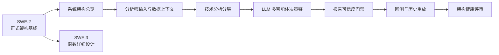

# 架构专题导航

本目录提供面向开发和设计评审的专题说明；[ASPICE SWE.2 软件架构设计](../aspice/SWE.2-software-architecture.md) 是正式软件架构基线，[SWE.3 软件详细设计](../aspice/SWE.3-software-detailed-design.md) 继续追踪到函数、单元测试、集成测试和验证测试。

## 推荐阅读路径

## 文档分工

| 专题 | 文档 | 解决的问题 |
|------|------|------------|
| 正式基线 | [SWE.2 软件架构设计](../aspice/SWE.2-software-architecture.md) | 软件组件、接口、依赖、动态行为和需求分配如何评审 |
| 系统总览 | [architecture.md](./architecture.md) | 数据如何从配置与抓取流向分析、决策、报告和归档 |
| 数据上下文 | [analyst-context.md](./analyst-context.md) | `MarketContext` 如何组装、各分析师接收哪些输入 |
| 技术分析 | [technical-analysis.md](./technical-analysis.md) | 检测、事实、机器上下文、人类文案和图表怎样分层 |
| SMC/PA 叙事 | [smc-pa-narrative.md](./smc-pa-narrative.md) | SMC 与 PA 怎样组合为计划、上下文和报告文案 |
| 图表边界 | [chart-layers.md](./chart-layers.md) | 多周期决策事实与 5m 主图裁剪为什么必须分开 |
| LLM 决策链 | [llm-agents.md](./llm-agents.md) | rule/LLM/hybrid 如何调度，各阶段如何传递结构化结论 |
| 报告可信度 | [report-trust.md](./report-trust.md) | 事实注册、授权、不变量、可靠度与归档门禁如何协作 |
| 回测重放 | [backtesting.md](./backtesting.md) | 规则基线与目标 LLM 全流水线重放的边界是什么 |
| 健康评审 | [review.md](./review.md) | 当前分层是否健康，回测到实盘的放行边界是什么 |

## 维护边界

- 组件或接口事实改变：先更新 SWE.2，再同步相应专题文档。
- 函数职责、输入输出、异常或调用关系改变：更新 SWE.3 及追踪链。
- 专题文档只解释稳定设计，不记录单次验收流水账；验收证据归入 `docs/reviews/` 或 ASPICE 测试域。
- Mermaid 图表达结构与数据流，紧随其后的表格负责补充职责、字段和约束；两者不得互相矛盾。
