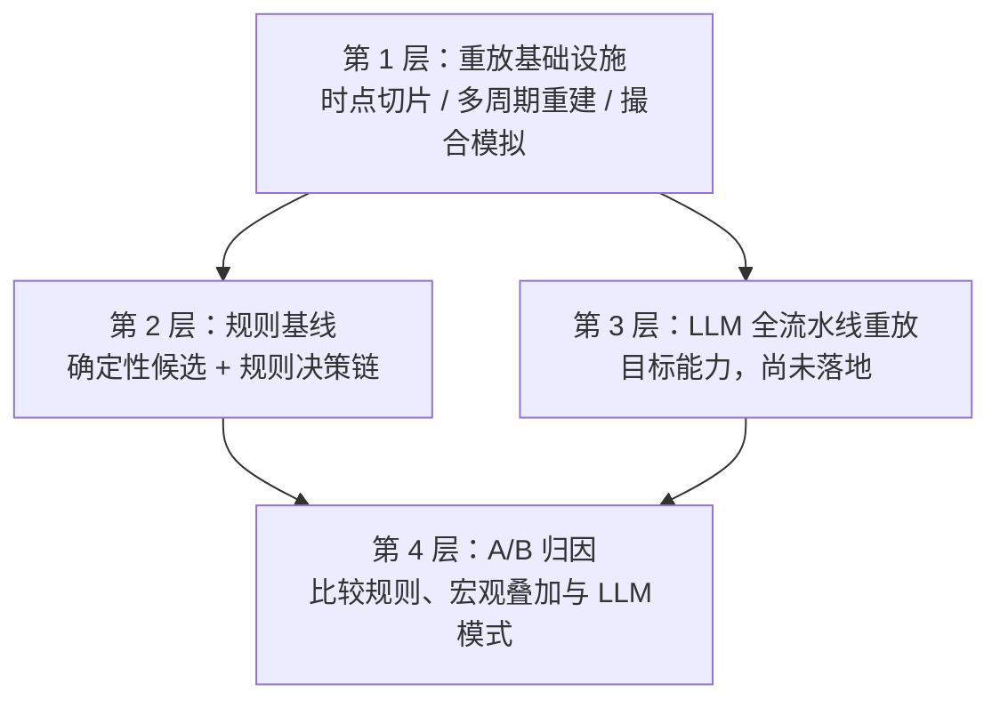
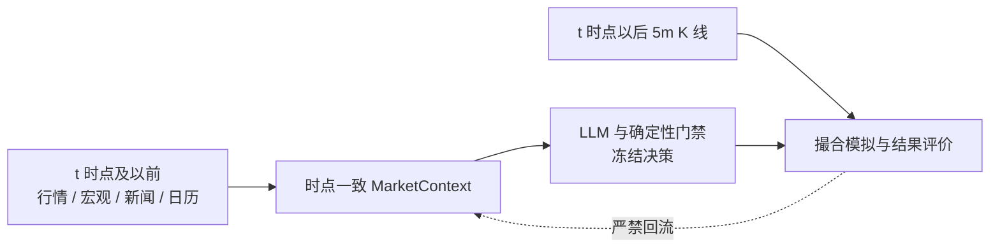

# 回测与历史重放架构

本文区分已经落地的重放基础设施与目标中的 LLM 全流水线重放。这一边界非常重要：

- 当前实现是“时点一致的历史重放框架 + 规则基线”。
- 目标实现是在历史时点完整重放当时会发生的 LLM 分析、研究辩论、交易决策、风险复核、经理授权和执行模拟。

因此，规则回测结果只能说明规则候选与确定性决策链的表现，不能表述为 LLM 决策系统的最终绩效。

## 1. 回测分层



### 1.1 第 1 层：重放基础设施

该层是所有严肃回测模式的公共底座，必须保留。职责包括：

- 在每个重放时点切分历史 5m OHLCV。
- 仅用该时点可见历史重建 15m、1h、4h、1d K 线。
- 仅用当时可见数据重算指标与 ICT/PA 结构。
- 对齐历史 DXY 等宏观输入，禁止读取未来 K 线。
- 模拟入场、止损、止盈、超时、费用、滑点和同一根 K 线内的歧义。
- 输出 R 倍数、回撤、形态分组和方向分组统计。

### 1.2 第 2 层：规则基线

该层回答：“没有 LLM 判断时，确定性规则候选和规则决策链如何表现？”

当前复用：

- `compute_trading_signals`
- 仅结构辩论
- 可选历史 DXY 加权
- 规则交易员
- 规则风险团队
- 规则经理
- 执行模拟器

解释边界：规则基线适合调试形态质量，但不等于完整 LLM 系统绩效。例如 `fvg_retest_short` 表现弱，只说明规则生成的 FVG 做空候选可疑，不能证明 LLM 会选择相同交易。

### 1.3 第 3 层：LLM 全流水线重放

这是目标能力。每个历史时点都应使用时点一致输入运行与实时应用相同的逻辑链：


该层回答：“如果项目在这个历史时刻运行，LLM 会形成什么分析和最终交易决策，之后结果如何？”

### 1.4 第 4 层：A/B 归因

第 3 层落地后，应比较模式而不是孤立阅读一次结果：

| 对照模式 | 目的 |
|----------|------|
| 规则基线 | 建立确定性下限 |
| 规则 + 历史 DXY | 识别宏观加权贡献 |
| 仅 LLM 分析 | 识别分析层贡献 |
| LLM 全流水线 | 评估完整决策贡献 |
| LLM 全流水线 + 历史 DXY | 评估宏观事实增益 |

只有这种对照才能判断 LLM 是否真正改善筛选、风险或回撤。

## 2. 机构级验证层

1. **连续重放**：覆盖固定历史区间，用于观察市场状态级表现、回撤形态与形态衰减。
2. **随机窗口重放**：使用确定性随机种子抽取多个历史窗口，报告中位数、坏窗口表现和窗口 R 的 p10。XAUUSD 具有日内时段性和宏观周期聚集，一个干净区间可能误导。
3. **滚动样本外验证**：计划能力；在训练窗口调参或选参，只在下一段未见窗口评估，是可调策略参数的主要过拟合门禁。
4. **市场状态拆分**：计划能力；比较高波动、低波动、趋势、震荡和事件邻近区间。事件标签至少覆盖 CPI、NFP、FOMC 和主要央行窗口。

## 3. 当前 MVP 范围

- 以 5m OHLCV 作为基础重放数据流。
- 从历史 5m 切片重建 15m、1h、4h、1d K 线。
- 只使用重放时点可见数据重算指标和结构。
- 可选一次性拉取 DXY 日线，并把每个重放点对齐到当时或之前的最后一根 DXY K 线。
- 复用规则基线栈：`compute_trading_signals`、结构辩论、规则交易员、风险团队、经理；历史 DXY 可选参与宏观加权。
- 在后续 5m K 线上模拟入场、止损、止盈与超时。
- 使用 R 倍数核算，不只看原始点数盈亏。
- 采用保守的同 K 线规则：若止损和止盈在同一根 OHLC K 线内都可触达，按止损先发生处理。

## 4. 历史 DXY 叠加

当 `BacktestConfig.use_macro=True` 时，重放引擎：

1. 一次性拉取 `TVC:DXY` 日线。
2. 每个重放时点只使用 `DXY.index <= timestamp` 的记录。
3. 计算 DXY 的 1 日、5 日、20 日变化。
4. 将美元强弱转换为黄金宏观偏向：DXY 上涨偏空黄金，DXY 下跌偏多黄金，小幅混合变化保持中性。
5. 使用 `macro_weight` 对评分和辩论做软调整。

DXY 只作为权重输入而不是硬开关，因为压力市场中黄金与美元可能同时上涨。

## 5. 目标：LLM 全流水线重放

### 5.1 时点一致输入契约

每个 LLM 重放点只能接收重放时点或之前已经存在的信息。

| 允许 | 禁止 |
|------|------|
| 截止时点 `t` 的 OHLCV 及其派生指标 | 用当前 DXY/US10Y 替代历史宏观数据 |
| 索引 `<= t` 的 DXY/US10Y | 在历史重放中读取当前新闻、日历、社媒 |
| 时间戳 `<= t` 的历史新闻、日历、社媒 | 未来 OHLCV、摆动点、FVG 回补、TP/SL 结果进入提示词 |
| 历史外部数据缺失时的明确 unavailable 标记 | 任何明示或暗示时点 `t` 之后结果的提示词 |

数据边界如下；未来数据只能进入撮合与评价，不能回流到决策输入：



### 5.2 LLM 阶段契约

LLM 重放必须逐阶段可审计：

| 阶段 | 必要输出与约束 |
|------|----------------|
| Analyst Team | 技术、基本面、新闻、情绪四类结构化报告 |
| Research | 独立的看多与看空研究 |
| Debate | 共识方向与共识强度 |
| Level Proposal | 候选价位；几何不合理时明确拒绝 |
| Trading Decision | `execute / reduce / wait`、具体候选信号索引或 LLM 价位，并说明拒绝其他候选的理由 |
| Risk / Manager | 批准、缩减或取消；外部数据缺失或事件风险未知时必须更保守 |

### 5.3 建议的首个实现

不要对每根 5m K 线无限调用 LLM。先使用受控样本：

```python
BacktestConfig(
    decision_mode="llm_pipeline",
    llm_sample_limit=10,
    step_bars=48,
    use_macro=True,
    llm_cache=True,
)
```

建议行为：

- 每隔 `step_bars` 才评估一次。
- 达到 `llm_sample_limit` 个 LLM 重放点后停止。
- 按确定性输入哈希缓存每次 LLM 请求与响应。
- 保存完整提示词负载、解析输出、模型名、延迟和解析错误。
- 任一必要 LLM 阶段校验失败时回退为 `wait`。

### 5.4 LLM 缓存

缓存目录建议独立设置，例如：

```text
tests/reports/backtest_llm_cache/
```

缓存键应包含时间戳、模型、阶段、规范化输入负载哈希、提示词/schema 版本。缓存内容应包含输入负载、消息、原始响应、解析响应、错误和延迟，以满足复现与调试要求。

### 5.5 输出结构

每个 LLM 重放决策应形成类似记录：

```json
{
  "timestamp": "2026-06-12T08:00:00Z",
  "price": 3421.5,
  "mode": "llm_pipeline",
  "external_availability": {
    "dxy": "historical",
    "us10y": "missing",
    "news": "missing",
    "calendar": "missing"
  },
  "analyst_team": {},
  "bullish": {},
  "bearish": {},
  "debate": {},
  "level_proposals": [],
  "decision": {
    "action": "execute",
    "primary_direction": "short",
    "selected_signal_indices": [0],
    "confidence": 0.62,
    "summary": "..."
  },
  "execution": {
    "entry_time": "...",
    "exit_reason": "stop",
    "r_multiple": -1.0
  }
}
```

### 5.6 安全默认值

- LLM 无法输出合法 JSON：`wait`。
- 历史外部数据缺失：明确标记缺失并降低置信度。
- LLM 选择的信号几何无效：拒绝该信号。
- LLM 提议价位仍必须通过确定性入场/SL/TP 几何校验。
- LLM 与确定性风险判断冲突：采用更保守结果。

## 6. 指标

| 指标 | 定义 |
|------|------|
| `trigger_rate` | 已触发交易数 / 生成信号数 |
| `tp1_success_rate` | 命中 TP 的交易数 / 已触发交易数 |
| `win_rate` | 盈利平仓数 / 已平仓数 |
| `total_r` | 所有已平仓交易的 R 总和 |
| `avg_r` | 每笔已平仓交易的平均 R |
| `profit_factor` | 盈利 R 总和 / 亏损 R 总和绝对值 |
| `expectancy_r` | `win_rate * avg_win_R - loss_rate * avg_loss_R` |
| `max_drawdown_r` | 累计 R 曲线最大回撤 |

## 7. 数据要求

CSV 输入需要 datetime 列（`datetime`、`time` 或 `timestamp`）或 datetime 索引，并包含 OHLC 列：

```text
Datetime,Open,High,Low,Close,Volume
```

字段名可以小写；`Volume` 可选，缺失时默认为零。

## 8. 当前限制

- 已实现回测仅覆盖第 1 层和第 2 层，不含第 3 层。
- 当前规则基线有意排除 LLM 阶段。
- 历史 DXY 已按时点重放；历史 US10Y、新闻和日历叠加仍在规划中。
- LLM 全流水线重放尚未实现，落地时必须遵守明确的时点一致输入契约。
- OHLC K 线内的价格路径未知，MVP 使用保守的止损优先假设。
- 点差、佣金和滑点以可配置点数成本建模，并非特定经纪商执行模型。

## 9. 相关文档

- [架构专题导航](./README.md)
- [系统架构总览](./architecture.md)
- [LLM 多智能体架构](./llm-agents.md)
- [架构健康评审](./review.md)
- [ASPICE SWE.2 软件架构设计](../aspice/SWE.2-software-architecture.md)
