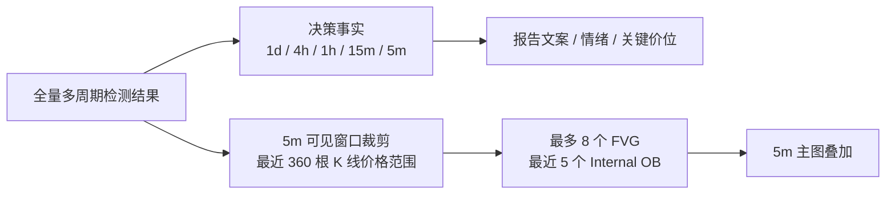

# 主图与多周期决策分层

机构报告把 **全周期 Lux 分析** 与 **5m 主图绘制** 分开处理。模块分层见 [technical-analysis.md](./technical-analysis.md)。

决策事实保留完整周期信息；主图只裁剪显示对象，不反向改变分析和交易判断。

## 两层职责

| 层级 | 内容 | 展示位置 |
|------|------|----------|
| **决策参考** | 1d/4h/1h/15m/5m 趋势、情绪、流动性、关键价位 | 情绪饼图、`narrative_sections` 五块、关键流动性、`context_levels` |
| **5m 主图叠加** | 可见 K 线范围内的 Lux FVG / Internal OB | `lightweight_chart.py` + `chart_zone_filters.py` |
| **4H/1H/15M 条带** | 仅 K 线（不画 OB/FVG） | `report_views.py` |

## 图表绘制规则（5m 主图）

实现：`src/viz/lightweight_chart.py` + `src/analysis/chart_zone_filters.py`

| 规则 | 说明 |
|------|------|
| **同周期** | 5m 图只画 5m 检测结果的色块 |
| **FVG** | active FVG，与可见 360 根 K 线价格范围重叠，最多 8 条 |
| **OB** | Internal OB，与可见价格范围重叠，最近 5 条（按时间） |
| **BOS/CHoCH/H/L** | 不画在图上；在 `narrative_sections` 与 LLM payload |
| **EQ 50%** | 不画（均衡价仅保留在 `TimeframeAnalysis` / LLM） |

## 报告字段

| 字段 | 含义 |
|------|------|
| `narrative_sections` | 市场总览 / 流动性 / 4H / 1H / 15m 五块文案（主路径） |
| `timeframes` | `build_tf_summaries()` → `build_tf_snapshot()` 每周期事实 |
| `liquidity` | `build_liquidity_entries()` 摆动 H/L + 远位 Strong/Weak |
| `market_overview` | 由 `narrative_sections.market_overview` 派生的兼容 bullet 列表 |

## 相关代码

- 检测：`luxalgo_smc.py` → `ict_pa.analyze_timeframe()`
- 事实：`tf_snapshot.py`、`report_facts.py`
- 文案：`narrative_sections.py`
- 主图裁剪：`chart_zone_filters.py`
