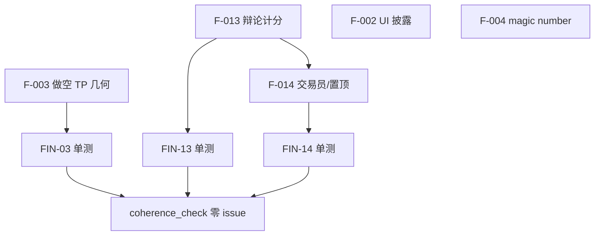

# GoldAnalysisAI 金融实现 Review 报告

**文档类型**：代码与业务逻辑评审（金融视角）
**评审对象**：GoldAnalysisAI — XAUUSD PA+ICT 分析报告生成器（Phase 1 MVP）
**评审范围**：已实现模块（数据层、指标层、ICT 结构、信号生成、规则 Agent 流水线、报告输出）
**不包含**：VaR/Sharpe/回测等未规划能力
**评审日期**：2026-06-14（静态代码评审）· **实跑补充**：2026-06-20
**分发对象**：开发团队、测试团队、产品/UI
**相关文档**：[docs/README.md](../../README.md) · [operations/setup.md](../../operations/setup.md) · [reverse-engineering.md](./reverse-engineering.md) · [architecture.md](../../architecture/architecture.md) · [tests/cases/catalog.yaml](../../../tests/cases/catalog.yaml) · **[financial-review-run-2026-06-20.md](./financial-review-run-2026-06-20.md)**（实跑评审）

---

## 1. 执行摘要

GoldAnalysisAI 当前是一个 **基于规则的结构化交易分析报告系统**，核心价值链为：

```
TradingView OHLCV → 技术指标 → ICT/PA 结构识别 → 多 Agent 决策 → JSON 报告 → Streamlit 展示
```

从金融专业角度看，系统定位清晰：**辅助分析展示，非实盘执行、非量化风控平台**。项目文档对 MVP 边界描述诚实，FAQ 已说明「胜率非回测」。

**总体评级**：🟡 **hybrid+LLM 可作研究辅助；纯规则模式尚不宜作独立决策依据**（实跑见 §1.1）

### 1.1 实跑结论摘要（2026-06-20）

| 模式 | 评级 | 说明 |
|------|------|------|
| 规则引擎 | 🟢 | **Phase 1 修复后**：辩论 **bearish** → 交易员 **short** → 与结论同向；`coherence_check` 零 issue |
| hybrid+LLM | 🟡 | 同行情下辩论偏空 → 做空，与结论一致 |
| 数据 / 结构 / 结论文案 | 🟢 | 现价对齐、多周期 ICT、偏空叙事合理 |

详报：[financial-review-run-2026-06-20.md](./financial-review-run-2026-06-20.md) · 快照：`tests/reports/financial_review_snapshot.json`

| 维度 | 评级 | 说明 |
|------|------|------|
| 数据完整性 | 🟡 中等 | 双源 1d 数据、Volume 缺失处理存在隐患；**现价 vs 5m 实跑一致** |
| 指标计算 | 🟢 基本合格 | EMA/VWAP/Fib 实现简单正确，EMA610 有已知限制 |
| 结构分析 | 🟡 中等 | 启发式 MVP，非标准 ICT，可接受但需标注 |
| 信号与风控 | 🟢 已修复 | F-003/F-013/F-014 已落地；FIN-03/13/14 + `coherence_check` 通过 |
| 合规与披露 | 🟢 基本合格 | UI「结构权重」、主/备选标签、决策链分歧横幅、R:R 封顶已落地 |
| 可测试性 | 🟢 良好 | `coherence_check` / `financial_review_run` / FIN-* 单测齐全 |

---

## 2. 系统边界确认（评审前提）

以下能力 **文档已声明未实现或占位**，本次 **不作为缺陷** 记录，但需在测试中确认 UI 不暗示已实现：

| 能力 | 文档状态 | 评审结论 |
|------|----------|----------|
| Sharpe / 最大回撤 / VaR / Beta | 未规划 | N/A |
| 历史回测胜率 | P6 路线图 | N/A |
| DXY / 新闻 / 经济日历 | 已接入 live API（金十 MCP / TradingView） | 拉取失败时回退占位；UI 须区分 live / fallback |
| LLM 交易员 / 风控 / 经理 | 当前为规则版 | 后续计划见 `roadmap.md` |
| 券商 Execution | 未实现 | N/A |

---

## 3. 已实现模块清单

### 3.1 数据层

| 文件 | 关键函数 | 金融职责 |
|------|----------|----------|
| `src/data/tradingview.py` | `fetch_multi_timeframe()`, `_resample()`, `_normalize()` | OHLCV 获取与多周期聚合 |
| `src/data/fetcher.py` | `daily_metrics()` | 日涨跌、日高/低、前收 |
| `src/data/aggregator.py` | `build_market_context()` | 组装 MarketContext |
| `src/data/sources/market.py` | `fetch_evidence()` | 价格/EMA 证据供 Agent |
| `src/data/sources/news.py` 等 | `fetch_external()` | 外部因子占位 |

### 3.2 指标层

| 文件 | 关键函数 | 金融职责 |
|------|----------|----------|
| `src/indicators/technical.py` | `add_emas()`, `add_vwap()`, `fibonacci_levels()` | EMA20/50/610、日锚 VWAP、Fib 回撤 |
| `src/indicators/verify.py` | `indicator_snapshot()` | 指标 sanity check |

### 3.3 结构分析层

| 文件 | 关键函数 | 金融职责 |
|------|----------|----------|
| `src/analysis/ict_pa.py` | `analyze_timeframe()`, `sentiment_score()` | Swing/BOS/CHoCH/FVG/OB/流动性、多周期情绪 |

### 3.4 策略与报告层

| 文件 | 关键函数 | 金融职责 |
|------|----------|----------|
| `src/analysis/report_engine.py` | `compute_trading_signals()`, `generate_trading_signals()`, `build_report()` | 入场/止损/止盈、路径推演、报告 JSON |
| `src/agents/trader.py` | `run_trader_agent(ctx, debate, signals)` | 信号选择与交易提案（不重复生成） |
| `src/agents/risk.py` | `run_risk_team()` | 三档仓位缩放 |
| `src/agents/manager.py` | `run_manager()` | 最终 execute/reduce/wait |

---

## 4. 发现项（Findings）

严重程度定义：

| 级别 | 含义 |
|------|------|
| **P0 — Critical** | 可能导致错误交易决策或逻辑失效 |
| **P1 — High** | 影响报告可信度或数据一致性 |
| **P2 — Medium** | MVP 范围内应修复的质量问题 |
| **P3 — Low** | 文档/命名/可维护性 |

---

### F-001 | ~~P0~~ **已修复** | 风控 `approved` 逻辑

| 项 | 内容 |
|----|------|
| **状态** | ✅ **2026-06-20 实跑验证通过** — `debate_bias == "neutral"` 时 `approved=False`（`risk.py` L40–42）。 |
| **残余风险** | 辩论非 neutral 但与结论反向时三档仍通过 → **F-013**；修复路径见 §7.2 Phase 2。 |
| **测试** | FIN-01 保留；增加 FIN-INT-03 辩论/情绪反向场景。 |

---

### F-002 | ~~P1~~ **已修复** | `win_rate` 字段命名与展示存在误导风险

| 项 | 内容 |
|----|------|
| **状态** | ✅ **Phase 2-A** — JSON 使用 `sentiment_bias_pct`；UI/图表统一「结构权重」，附「非回测胜率」标注。 |
| **测试** | FIN-02、FIN-UI-01（手工） |

---

### F-003 | ~~**P0**~~ **已修复** | 激进反抽做空 TP/SL 几何错误

| 项 | 内容 |
|----|------|
| **状态** | ✅ **Phase 1-A** — `_sell_fvg_targets()` 以 `entry_mid` 向下推算 TP；几何无效或 R:R=`N/A` 时跳过信号。 |
| **验收** | `coherence_check.py` 零 issue；FIN-03 全绿（含 2026-06-20 快照回归）。 |

---

### F-004 | ~~P1~~ **已修复** | 止损/入场使用 Magic Number，未与波动率挂钩

| 项 | 内容 |
|----|------|
| **状态** | ✅ **Phase 2-B** — `SIGNAL_SWEEP_OFFSET` / `SIGNAL_SL_BELOW_SWING` 配置化（默认 5/9）；R:R > 1:8 展示「远端限价」。 |
| **测试** | FIN-04 |

---

### F-005 | ~~P1~~ **已修复** | 双数据源可能导致价格/指标不一致

| 项 | 内容 |
|----|------|
| **状态** | ✅ **Phase 3-A** — `report["meta"]["price_drift_1d"]` 记录独立 1d vs 5m 聚合价差；\|drift\| > 0.5 时写入 `meta.warnings`。 |
| **测试** | IND-01（现价 vs 5m）；集成可选断言 drift 字段存在。 |

---

### F-006 | ~~P1~~ **已修复** | `build_conclusion` 硬编码价格 / 情绪错配

| 项 | 内容 |
|----|------|
| **状态** | ✅ 从 `signals` 动态生成区间；`must_do` / `starred` / `action` 按 bullish、bearish、ranging 主导情绪与 `signal.theme` 对齐（看多不再套用看空模板）。 |
| **测试** | FIN-06 保留回归；`test_bullish_conclusion_uses_long_plan_not_short_template`。 |

---

### F-007 | P2 | Fibonacci `probability` 为静态常量

| 项 | 内容 |
|----|------|
| **位置** | `src/indicators/technical.py` L48–53 |
| **现象** | 0.382→0.65、0.618→0.70 等为硬编码，非统计输出。 |
| **金融风险** | 用户可能理解为「该价位反弹概率 70%」，属于伪精度。 |
| **开发建议** | 重命名为 `display_weight` 或移除；UI 不展示为概率。 |
| **测试建议** | 断言 fibonacci[*].probability 为静态映射，非动态计算。 |

---

### F-008 | P2 | EMA610 历史不足但仍在高周期展示

| 项 | 内容 |
|----|------|
| **位置** | `src/indicators/technical.py`；`verify.py` L36–37 |
| **现象** | 5m 仅 ~5000 根，4h resample 后 ~104 根，远低于 610。verify 有 notes 警告，pipeline 不阻断。 |
| **金融风险** | 长周期 EMA 与 TradingView 标准值偏差大。 |
| **开发建议** | bar < 610 时在 report 标注「EMA610 仅供参考」；4h/1d 可不计算 EMA610。 |
| **测试建议** | IND-12 已有；新增 4h/1d snapshot EMA610 偏差警告。 |

---

### F-009 | ~~P2~~ **已修复** | VWAP 日切分与 Volume 缺失处理

| 项 | 内容 |
|----|------|
| **状态** | ✅ **Phase 3-B** — `indicator_snapshot` notes 合并进 `report["meta"]["indicator_notes"]` 与 `warnings`。 |
| **测试** | FIN-09 |

---

### F-010 | ~~P2~~ **部分修复** | 外部因子 fallback 可能被 LLM 当作事实

| 项 | 内容 |
|----|------|
| **状态** | ✅ **Phase 3-C** — `sources` 含 `placeholder` 时 UI 橙色「占位/回退」标签（`dashboard_components._source_tags`）。LLM prompt 警告待后续。 |
| **测试** | FIN-10、FIN-UI-02 |

---

### F-011 | ~~P2~~ **已修复** | Agent 规则链边界行为未充分测试

| 项 | 内容 |
|----|------|
| **状态** | ✅ **Phase 3-D** — `tests/unit/test_agent_chain.py`（FIN-11）：bearish→short、neutral 风控拒绝、conservative reduce、三档否决→wait。 |

---

### F-012 | P3 | 文档与代码列名不一致

| 项 | 内容 |
|----|------|
| **位置** | `development.md` §5.3 vs `technical.py` |
| **现象** | 文档写 `EMA_20`，代码为 `EMA20`。 |
| **开发建议** | 同步文档。 |

---

### F-013 | ~~**P0**~~ **已修复** | 规则模式辩论共识可与结构情绪背离

| 项 | 内容 |
|----|------|
| **状态** | ✅ **Phase 1-B** — `pct/50` 加权 + 情绪主导 tiebreaker；2026-06-20 快照 → `consensus_bias=bearish`。 |
| **验收** | FIN-13；`coherence_check` 零 issue。 |

---

### F-014 | ~~P1~~ **已修复** | 交易员在结论偏空时仍可能置顶逆势做多

| 项 | 内容 |
|----|------|
| **状态** | ✅ **Phase 1-C + 2-C** — trader 尊重结构主导方向；orchestrator 按 sentiment 重排；UI「主策略」/「逆势备选」徽章。 |
| **验收** | FIN-14；首卡 short；`coherence_check` 零 issue。 |

---

## 5. 各模块金融评价

### 5.1 指标计算（EMA / VWAP / Fib / daily_metrics）

| 项目 | 评价 |
|------|------|
| EMA | 标准 `ewm(span, adjust=False)`，实现正确 |
| VWAP | 日锚 cumsum 公式正确；session 与 volume 见 F-009 |
| Fib | 回撤价位正确；probability 语义见 F-007 |
| daily_metrics | 简单收益率 MVP 足够 |
| ema_relation | ±0.1% 阈值合理 |

### 5.2 ICT/PA 结构（MVP 启发式）

| 项目 | 评价 |
|------|------|
| Swing / BOS/CHoCH | 与 reverse-engineering 一致 |
| FVG/OB | 启发式，非 ICT 标准；MVP 可接受 |
| sentiment_score | 4h 35% / 1h 30% / 15m 20% / 5m 15% 权重合理 |
| 缺失项 | Kill Zone、Breaker Block 等 — 文档已知，P3 |

### 5.3 信号生成

| 项目 | 评价 |
|------|------|
| 三模板 | 与 reverse-engineering §2.5 一致 |
| SL/TP 几何 | **激进 FVG 做空实跑无效**（F-003）；保守 OB 做空有效 |
| R:R 展示 | 动态计算；几何无效时 N/A — 但无效信号仍出现在报告中 |
| position_size | 描述性字符串，与 2% 风险规则未联动 |
| 信号去重 | ✅ trader 与 report 共用 `compute_trading_signals(ctx)` |

### 5.4 风控与经理（规则版）

| 项目 | 评价 |
|------|------|
| 三档 scale | 1.0 / 0.7 / 0.4 概念清晰 |
| 优先级 | conservative → neutral → aggressive，偏保守 |
| approved（neutral） | ✅ 已修复（F-001） |
| 方向过滤 | ❌ 不校验辩论/结论与 sentiment 同向（F-013） |
| 信号置顶 | ✅ 偏空时 short 信号置顶 + 主/备选标签 |

---

## 6. 测试团队用例清单

已在 [`tests/cases/financial-review-cases.md`](../../../tests/cases/financial-review-cases.md) 与 [`catalog.yaml`](../../../tests/cases/catalog.yaml) 登记（前缀 **`FIN-*`** / **`FIN-UI-*`**，避免与 Streamlit 功能用例 `FN-10+` 冲突）。

### 6.1 单元测试（无网络）— 摘要

| ID | 模块 | 用例描述 | 关联 Finding |
|----|------|----------|--------------|
| FIN-01 | `risk.py` | neutral 共识下三档 approved 行为 | F-001 |
| FIN-02 | `report_engine` | win_rate 等于 sentiment 分量 | F-002 |
| FIN-03 | `report_engine` | risk_reward 计算与展示一致 | F-003 |
| FIN-04 | `report_engine` | SL/TP 方向性与 magic number | F-004 |
| FIN-06 | `report_engine` | conclusion 无硬编码价格 | F-006 |
| FIN-07 | `technical` | Fib probability 静态映射 | F-007 |
| FIN-09 | `technical` | Volume 全 0 时 VWAP 警告 | F-009 |
| FIN-11 | trader+manager | debate 各 bias 下 proposal/decision | F-011, F-014 |
| FIN-13 | `debate.py` | 结构情绪主导时辩论不反向 | F-013 |
| FIN-14 | `trader.py` | 偏空 sentiment 时主提案非 long | F-014 |

详设与 FIN-05/08/10、场景表见 **financial-review-cases.md**。

### 6.2 集成测试 — 摘要

| ID | 用例描述 | 关联 Finding |
|----|----------|--------------|
| FIN-05 | metrics 与 5m close（已实现：`IND-01`） | F-005 |
| FIN-INT-01 | 1d 独立 vs resample 价差记录 | F-005 |
| FIN-INT-02 | 末 bar 时间戳新鲜度 | 数据质量 |
| FIN-INT-03 | 规则模式一致性（`coherence_check.py`） | F-003, F-013, F-014 |
| FIN-INT-04 | hybrid+LLM 全流程耗时（阈值 **320s**） | PERF-01 |
| FIN-INT-05 | 实跑快照回归（`financial_review_run.py`） | 全 P0 |

### 6.3 手工 / UI 验收 — 摘要

| ID | 验收项 |
|----|--------|
| FIN-UI-01 | 「胜率/概率」须标注非回测 |
| FIN-UI-02 | DXY/新闻/日历/TV 社媒显示 live 或明确 fallback 说明 |
| FIN-UI-03 | manager reduce 时展示 position_scale |
| FIN-UI-04 | EMA610 不足时报告有警告 |
| FIN-UI-05 | 免责声明可见 |
| FIN-UI-06 | 辩论与结论反向时显示「决策链分歧」横幅（§7.2 Phase 2-D） |

---

## 7. 修复路径规划（2026-06-20）

> **目标**：规则模式下「结论 ↔ 辩论 ↔ 交易计划 ↔ 信号几何」四层同向；`coherence_check.py` 实跑零 issue。
> **原则**：先 P0 阻断误导，再 P1 体验与披露，P2 数据质量 backlog。
> **门禁**：每 Phase 合并前跑 `python tests/run.py --financial` + `coherence_check.py`。

### 7.1 问题依赖关系



### 7.2 Phase 1 — P0 阻断 ✅ **已完成**（2026-06-20）

**合并标准**：`coherence_check.py` 退出码 0；2026-06-20 快照场景辩论/交易员与 sentiment 同向。

| 步骤 | 状态 |
|------|------|
| 1-A F-003 做空几何 | ✅ |
| 1-B F-013 辩论计分 | ✅ |
| 1-C F-014 交易员/重排 | ✅ |

#### 1-A · F-003 激进反抽做空几何

| 项 | 内容 |
|----|------|
| **文件** | `src/analysis/report_engine.py` → `generate_trading_signals()` |
| **改动** | ① `entry_mid = (entry_low+entry_high)/2`；② `tp1 = entry_mid - max(zone_width*1.5, price-entry_mid*0.003)`；③ 若 FVG 区在现价下方且 `entry_high < price`，用 `entry_high` 作反弹锚点而非 `price`；④ `sl = max(entry_high + zone_width*0.5, entry_mid + min_sl)`，`min_sl` 取 `ATR14(5m)*0.5` 或配置常量；⑤ 几何仍无效则**不 append** 该信号。 |
| **测试** | 扩展 `tests/unit/test_financial_review.py::test_sell_signal_geometry`；fixture 使用 snapshot 价位（entry 4149.83, price 4155.40）。 |

#### 1-B · F-013 辩论计分

| 项 | 内容 |
|----|------|
| **文件** | `src/agents/debate.py` → `run_debate()` |
| **改动** | 结构情绪加权由 `pct/100` 改为 `pct/50`（4h 主导情绪放大）；若 `abs(bull_pct-bear_pct) >= 10` 且 `abs(combined_bull-combined_bear) < 2.0`，**tiebreaker** 取 sentiment 主导方向；`neutral` 阈值保持 0.15。 |
| **测试** | 新增 `tests/unit/test_debate_coherence.py`：注入 snapshot 研究分（bull 10.69 / bear 9.23, sentiment 45/25）→ 期望 `consensus_bias=bearish`。 |

#### 1-C · F-014 交易员与信号置顶

| 项 | 内容 |
|----|------|
| **文件** | `src/agents/trader.py`；`src/core/orchestrator.py`（重排逻辑） |
| **改动** | ① 传入 `sentiment` 或从 `analyses` 调 `sentiment_score`；② 当 `bearish >= bullish` 且 `debate.consensus_bias != "bullish"` 或 `strength < 0.6` 时 `primary_dir=short`，`chosen = short_idx[:2]`；③ long 仅作备选追加；④ 经理重排：首卡优先 `theme` 与 `conclusion` 主方向一致（偏空 → short 信号在前）。 |
| **测试** | `tests/unit/test_trader_sentiment.py`：偏空 sentiment + 修复后 bearish debate → `primary_direction=short`。 |

### 7.3 Phase 2 — P1 可信度 ✅ **已完成**（2026-06-20）

| 任务 | Finding | 状态 |
|------|---------|------|
| 2-A | F-002 | ✅ 结构权重 UI |
| 2-B | F-004 | ✅ 配置常量 + R:R 封顶 |
| 2-C | F-014 UI | ✅ 主策略/逆势备选标签 |
| 2-D | F-013 UI | ✅ 决策链分歧横幅 |

### 7.4 Phase 3 — P2 数据与 Agent 边界 ✅ **已完成**（2026-06-20）

| 任务 | Finding | 状态 |
|------|---------|------|
| 3-A | F-005 | ✅ `price_drift_1d` meta |
| 3-B | F-009 | ✅ `indicator_notes` 上浮 |
| 3-C | F-010 | ✅ placeholder 橙色标签 |
| 3-D | F-011 | ✅ `test_agent_chain.py` |
| 集成 | PERF | ✅ `PIPELINE_MAX_SECONDS=320` |

### 7.5 模式与 CI 策略

| 场景 | 推荐模式 | 门禁 |
|------|----------|------|
| 日常开发 / CI | `rule` + `coherence_check` | exit 0 |
| 发版前 | `--financial` + `coherence_check` + 可选 `--integration` | 集成 PERF ≤ 320s |
| 演示 / 研究 | `hybrid` + LLM | 人工核对 agent_trace 与结论 |

### 7.6 完成定义（Definition of Done）

- [x] P0：`coherence_check.json` → `"issues": []`
- [x] P0：快照场景 debate=bearish, trader=short, 首卡=激进反抽做空（short）
- [x] P0：所有 SELL 信号 `TP1 < entry_mid` 且 `SL > entry_mid`
- [x] P1：UI 无未标注「胜率」；R:R > 1:8 有免责声明
- [x] 文档：`financial-review-run-*.md` 追加「修复后复测」章节（§14）

---

## 8. 已完成修复批次（与 §7 对齐）

| 批次 | Finding | 交付物 |
|------|---------|--------|
| **Phase 1** | F-003, F-013, F-014 | 辩论/交易/信号几何一致 + FIN-03/13/14 |
| **Phase 2** | F-002, F-004, UI 披露 | FIN-UI-01/06 |
| **Phase 3** | F-005, F-009, F-010, F-011 | 数据质量 + Agent 边界 |
| **待复核** | F-007, F-008, F-012 | 统计口径、指标展示和文档命名 |

Sharpe、VaR、回测胜率、Execution、LLM 交易员/风控、完整 ICT 标准实现不属于本次已完成修复批次；后续计划统一维护在 [roadmap.md](../../planning/roadmap.md)。

---

后续交易假设系统、宏观事件门控和回测闭环计划统一维护在 [roadmap.md](../../planning/roadmap.md#交易假设系统)。本文只保留金融发现、已完成修复和验收口径。

---

## 9. 金融合规与披露建议（产品/UI）

1. 报告首页或 footer 固定展示：**「本报告基于规则结构与情绪权重，胜率非历史回测，不构成投资建议。」**
2. 所有 `probability` / `win_rate` 类字段在 UI 使用「结构权重」而非「概率/胜率」。
3. 占位宏观数据（DXY、日历）必须视觉区分于实时数据。
4. `position_size` / `position_scale` 须说明：**展示档位，非基于账户权益计算的实际仓位。**

---

## 10. 结论

GoldAnalysisAI Phase 1 MVP **架构合理、数据与结构层实跑合格**，作为 PA+ICT 结构化报告生成器具备迭代基础。

**2026-06-20 实跑后**，P0/P1 金融风险已通过三阶段修复闭环：

1. ~~**P0 — 决策链脱节**（F-013/F-014）~~ → ✅ 规则模式与结论同向
2. ~~**P0 — 信号不可执行**（F-003）~~ → ✅ 做空几何正确或跳过
3. ~~**P1 — 披露与参数**（F-002/F-004）~~ → ✅ 结构权重、配置化、R:R 封顶

**F-001、F-006 已修复**；规则模式与 hybrid+LLM 均可作为研究辅助基线。P2 数据质量（F-005/F-009/F-010/F-011）已落地；P3 回测与真实胜率仍按路线图后续实施。

---

## 11. 修订记录

| 版本 | 日期 | 说明 |
|------|------|------|
| 1.0 | 2026-06-14 | 初版 — Phase 1 MVP 金融 Review |
| 1.1 | 2026-06-15 | 同步 live 外部数据源；F-010 fallback 语义 |
| 1.2 | 2026-06-20 | 实跑评审；F-001/F-006 关闭；F-003/F-013 升 P0；新增 F-014、§7 修复路径 |
| 1.3 | 2026-06-20 | 三阶段修复完成：Phase 1–3 代码 + 文档；DoD 全勾选；`coherence_check` 零 issue |

## 2026-06-21 流动性可靠性验收口径

目标：把“流动性”从静态价位提示升级为可解释、可降级、可回放验证的交易假设输入。LLM 可以使用这些输入给点位，但系统必须说明点位依据和确认条件。

本文只维护金融验收口径；后续任务和优先级见 [roadmap.md §流动性质量专项](../../planning/roadmap.md#流动性质量专项)，代码边界见 [architecture.md §8.2](../../architecture/architecture.md#82-流动性质量层)。

验收原则：

1. 未扫穿、未收回或无结构转强时，sweep 类信号只能是 `candidate` 或 `watch`，不能表达为可执行 `active`。
2. equal highs/lows、stop-hunt 偏移和 sweep buffer 必须随波动率缩放，不能长期依赖固定点数。
3. 每条 sweep 信号必须在 `score_reasons` 中展示扫穿深度、收回情况、结构确认和降级原因。
4. 跌破后未收回时，应归类为 breakout continuation 或 failed reclaim，不允许表述为“扫流动性做多”。
5. 没有历史回放样本前，UI 不展示“胜率”或暗示统计概率。
