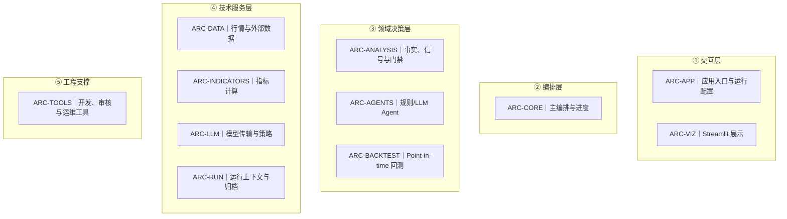
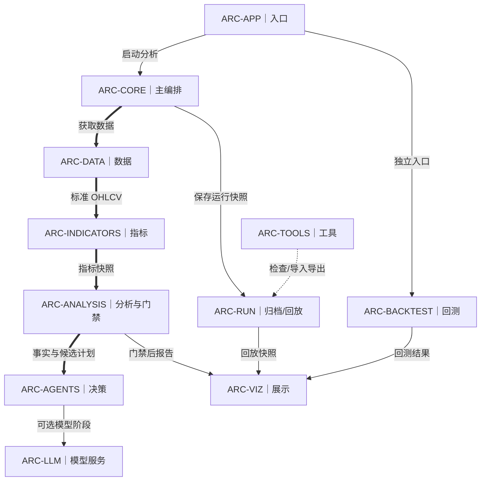
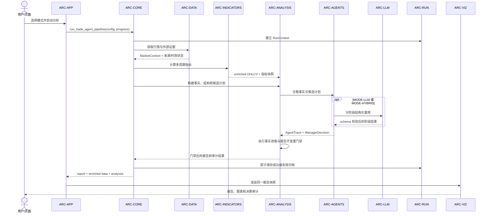
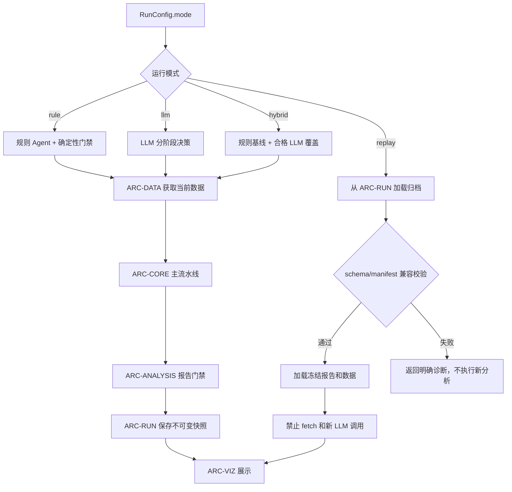
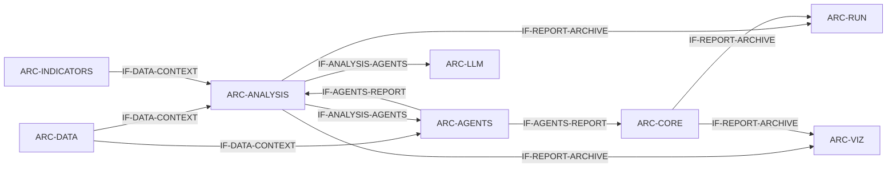

# SWE.2 软件架构设计

| 属性 | 内容 |
|---|---|
| ASPICE 过程 | SWE.2 |
| 状态 | 受控基线 |
| 用途 | 评审组件职责、接口和运行模式 |

> 本文是 SWE.2 唯一正式入口。结构化校验数据位于 `../_machine/`；普通评审无需进入机器目录。

## 专题导航

| 专题 | 文档 | 评审问题 |
|---|---|---|
| 系统数据流 | [system-overview.md](./system-overview.md) | 数据如何从配置、抓取进入分析、决策、报告和归档 |
| 分析师上下文 | [analyst-context.md](./analyst-context.md) | `MarketContext` 如何组装并分配给分析师 |
| 技术分析分层 | [technical-analysis.md](./technical-analysis.md) | 检测、事实、机器上下文、文案和图表如何隔离 |
| SMC/PA 叙事 | [smc-pa-narrative.md](./smc-pa-narrative.md) | SMC 与 PA 如何组成计划和报告 |
| 图表边界 | [chart-layers.md](./chart-layers.md) | 完整决策事实与 5m 显示裁剪如何分离 |
| LLM 决策链 | [llm-agents.md](./llm-agents.md) | rule、LLM、hybrid 阶段如何协作 |
| 报告可信度 | [report-trust.md](./report-trust.md) | 事实注册、授权、不变量和归档门禁如何协作 |
| 回测与重放 | [backtesting.md](./backtesting.md) | 规则基线与目标 LLM 重放的边界 |
| 架构健康评审 | [health-review.md](./health-review.md) | 当前分层和逐级执行边界是否健康 |

专题文档负责解释本页组件和接口，不重新定义平行架构。

## 架构总览

| 组件 | 名称 | 软件单元 | 职责 |
|---|---|---|---|
| ARC-APP | 应用入口与运行配置 | 6 | 解析配置，启动 Streamlit，页面复用会话报告。 |
| ARC-CORE | 主编排与进度 | 12 | 按配置驱动 fetch、analysis、agents、report、archive，并发布阶段状态。 |
| ARC-DATA | 行情与外部数据 | 30 | 拉取、标准化、合并、标记来源与失败，并计算 as-of。 |
| ARC-INDICATORS | 指标计算 | 3 | 从冻结 OHLCV 计算技术指标并报告输入质量。 |
| ARC-ANALYSIS | 事实、结构、信号与报告门禁 | 29 | 计算 point-in-time 事实、计划、授权门禁、叙事和可靠度。 |
| ARC-AGENTS | 规则/LLM Agent 编排 | 36 | 运行 Analyst、Research、Debate、Levels、Trader、Risk、Manager 并保留来源。 |
| ARC-LLM | LLM 传输、上下文和策略 | 9 | 路由模型、构造上下文、传输/重试、解析并记录 I/O。 |
| ARC-RUN | 运行上下文与归档 | 12 | 建立运行 ID，原子保存成功/失败归档，验证兼容并加载回放。 |
| ARC-BACKTEST | Point-in-time 回测 | 6 | 截取历史数据、生成规则信号、应用宏观状态、模拟成交并汇总指标。 |
| ARC-VIZ | Streamlit 展示 | 21 | 展示报告、图表、外部数据、决策链、拒绝原因、回放和配置。 |
| ARC-TOOLS | 开发、审核与运维工具 | 18 | 校验连接、检查归档、生成样例和执行 ASPICE 一致性检查。 |

## 模块分层图

本图只表达职责分层，不绘制依赖线；组件 ID 可与后续组件章节直接对应。

## 核心依赖主干图

仅保留最重要的正向调用和数据主干，返回值、回调及完整接口扇出由后续时序图和接口流向图表达。实线为运行依赖，虚线为工程支撑关系。

## 主流水线时序图

## 运行模式与回放边界图

## 跨组件接口流向图

## 运行模式

| 模式 | 行为 |
|---|---|
| MODE-RULE | 规则 Agent 和确定性门禁，不调用 LLM。 |
| MODE-LLM | 配置的 LLM 阶段提供结构化结果，失败显式记录。 |
| MODE-HYBRID | 规则 baseline 先运行，合格 LLM 结果才可覆盖。 |
| MODE-REPLAY | 加载兼容归档，不执行 fetch 或新的 LLM 调用。 |

## ARC-APP

**名称**：应用入口与运行配置

| 属性 | 内容 |
|---|---|
| 源码范围 | app.py、run_app.py、views/** |
| 接口规格 | [run_app.py CLI](#arc-app-if-01)、[Streamlit session](#arc-app-if-02)、[RunConfig](#arc-app-if-03) |
| 动态行为 | 解析配置，启动 Streamlit，页面复用会话报告。 |
| 关联需求 | [SWR-CORE-002](../SWE.1-software-requirements.md#swr-core-002)、[SWR-UI-001](../SWE.1-software-requirements.md#swr-ui-001)、[SWR-CFG-001](../SWE.1-software-requirements.md#swr-cfg-001) |
| 详细设计 | [查看 6 个软件单元](../SWE.3-detailed-design/ARC-APP.md) |

### ARC-APP-IF-01

**接口名称**：`run_app.py CLI`

| 属性 | 说明 |
|---|---|
| 接口类型 | 命令行接口 |
| 作用 | 启动受控 Streamlit 进程并清理本项目遗留进程 |
| 输入参数 | --port: 可选监听端口，默认 8501；环境变量: 从 .env 与宿主环境读取 |
| 输出 / 返回 | 进程退出码与启动日志 |
| 失败 / 异常行为 | Python 或 Streamlit 不可用时终止并输出明确错误 |

### ARC-APP-IF-02

**接口名称**：`Streamlit session`

| 属性 | 说明 |
|---|---|
| 接口类型 | 会话状态接口 |
| 作用 | 在页面重运行之间保存报告、配置和生成状态 |
| 输入参数 | session_state key: 状态键；value: 对应页面状态或报告对象 |
| 输出 / 返回 | 当前会话内可复用的状态值 |
| 失败 / 异常行为 | 缺失键使用受控默认值，不跨用户会话共享 |

### ARC-APP-IF-03

**接口名称**：`RunConfig`

| 属性 | 说明 |
|---|---|
| 接口类型 | 数据接口 |
| 作用 | 向流水线提供冻结且可审计的运行模式和供应商配置 |
| 输入参数 | mode: rule/llm/hybrid/replay；provider/model: LLM 路由；功能开关与超时: 环境配置 |
| 输出 / 返回 | 不可变运行配置对象 |
| 失败 / 异常行为 | 非法配置在启动或配置解析阶段拒绝 |

## ARC-CORE

**名称**：主编排与进度

| 属性 | 内容 |
|---|---|
| 源码范围 | src/core/**、src/pipeline.py |
| 接口规格 | [run_trade_agent_pipeline](#arc-core-if-01)、[ProgressReporter](#arc-core-if-02)、[core dataclasses](#arc-core-if-03) |
| 动态行为 | 按配置驱动 fetch、analysis、agents、report、archive，并发布阶段状态。 |
| 关联需求 | [SWR-CORE-001](../SWE.1-software-requirements.md#swr-core-001)、[SWR-CORE-002](../SWE.1-software-requirements.md#swr-core-002)、[SWR-LLM-001](../SWE.1-software-requirements.md#swr-llm-001)、[SWR-REP-001](../SWE.1-software-requirements.md#swr-rep-001)、[SWR-REP-003](../SWE.1-software-requirements.md#swr-rep-003)、[SWR-CFG-001](../SWE.1-software-requirements.md#swr-cfg-001)、[SWR-NFR-001](../SWE.1-software-requirements.md#swr-nfr-001)、[SWR-NFR-002](../SWE.1-software-requirements.md#swr-nfr-002) |
| 详细设计 | [查看 12 个软件单元](../SWE.3-detailed-design/ARC-CORE.md) |

### ARC-CORE-IF-01

**接口名称**：`run_trade_agent_pipeline`

| 属性 | 说明 |
|---|---|
| 接口类型 | 函数接口 |
| 作用 | 编排数据获取、分析、Agent、报告和归档的完整执行顺序 |
| 输入参数 | config: RunConfig；progress: 可选 ProgressReporter；replay 输入: 可选归档上下文 |
| 输出 / 返回 | 结构化报告、行情数据和分析结果 |
| 失败 / 异常行为 | 阶段失败写入进度与失败归档，不静默伪造成功结果 |

### ARC-CORE-IF-02

**接口名称**：`ProgressReporter`

| 属性 | 说明 |
|---|---|
| 接口类型 | 协议接口 |
| 作用 | 发布阶段开始、进度、LLM I/O、成功和失败事件 |
| 输入参数 | stage/event: 阶段或事件标识；message/payload: 可展示消息和审计载荷 |
| 输出 / 返回 | 无业务返回值，向观察者发布状态 |
| 失败 / 异常行为 | 观察器不得改变流水线业务判定 |

### ARC-CORE-IF-03

**接口名称**：`core dataclasses`

| 属性 | 说明 |
|---|---|
| 接口类型 | 数据接口 |
| 作用 | 在编排阶段间传递类型化状态和结果 |
| 输入参数 | 字段由对应 dataclass 定义；时间和来源字段必须保留 |
| 输出 / 返回 | 可序列化或可验证的阶段对象 |
| 失败 / 异常行为 | 必填字段缺失时由构造或门禁拒绝 |

## ARC-DATA

**名称**：行情与外部数据

| 属性 | 内容 |
|---|---|
| 源码范围 | src/data/** |
| 接口规格 | [DataFetchResult](#arc-data-if-01)、[MarketContext](#arc-data-if-02)、[DataSource](#arc-data-if-03)、[archive payload](#arc-data-if-04) |
| 动态行为 | 拉取、标准化、合并、标记来源与失败，并计算 as-of。 |
| 关联需求 | [SWR-CORE-001](../SWE.1-software-requirements.md#swr-core-001)、[SWR-DATA-001](../SWE.1-software-requirements.md#swr-data-001)、[SWR-DATA-002](../SWE.1-software-requirements.md#swr-data-002)、[SWR-DATA-003](../SWE.1-software-requirements.md#swr-data-003)、[SWR-CFG-001](../SWE.1-software-requirements.md#swr-cfg-001)、[SWR-NFR-001](../SWE.1-software-requirements.md#swr-nfr-001) |
| 详细设计 | [查看 30 个软件单元](../SWE.3-detailed-design/ARC-DATA.md) |

### ARC-DATA-IF-01

**接口名称**：`DataFetchResult`

| 属性 | 说明 |
|---|---|
| 接口类型 | 数据接口 |
| 作用 | 汇总单一数据源的成功数据、来源元数据和失败原因 |
| 输入参数 | data: 获取结果；source/as_of: 来源与截止时间；error: 可选失败信息 |
| 输出 / 返回 | 供 MarketContext 合并的标准结果 |
| 失败 / 异常行为 | 外部失败显式保存在 error/status 中 |

### ARC-DATA-IF-02

**接口名称**：`MarketContext`

| 属性 | 说明 |
|---|---|
| 接口类型 | 数据接口 |
| 作用 | 向分析层提供时间对齐后的行情、宏观、新闻和日历上下文 |
| 输入参数 | timeframes: 各周期 OHLCV；external facts: 外部证据；as_of: 截止时间 |
| 输出 / 返回 | 冻结的市场上下文快照 |
| 失败 / 异常行为 | 缺失或过期来源必须带状态，不得冒充实时事实 |

### ARC-DATA-IF-03

**接口名称**：`DataSource`

| 属性 | 说明 |
|---|---|
| 接口类型 | 协议接口 |
| 作用 | 统一不同市场和外部数据供应商的获取边界 |
| 输入参数 | symbol/timeframe: 标的与周期；start/end 或 as_of: 时间范围；timeout: 超时 |
| 输出 / 返回 | DataFetchResult 或标准化记录集合 |
| 失败 / 异常行为 | 网络、鉴权、限流和空数据转换为显式失败状态 |

### ARC-DATA-IF-04

**接口名称**：`archive payload`

| 属性 | 说明 |
|---|---|
| 接口类型 | 数据接口 |
| 作用 | 将获取数据及来源元数据交给归档组件持久化 |
| 输入参数 | frames/facts: 数据内容；source metadata: 来源、时间与状态 |
| 输出 / 返回 | 可 JSON/表格序列化的归档载荷 |
| 失败 / 异常行为 | 不可序列化字段在保存前校验失败 |

## ARC-INDICATORS

**名称**：指标计算

| 属性 | 内容 |
|---|---|
| 源码范围 | src/indicators/** |
| 接口规格 | [enriched OHLCV](#arc-indicators-if-01)、[indicator snapshot](#arc-indicators-if-02) |
| 动态行为 | 从冻结 OHLCV 计算技术指标并报告输入质量。 |
| 关联需求 | [SWR-ANA-001](../SWE.1-software-requirements.md#swr-ana-001) |
| 详细设计 | [查看 3 个软件单元](../SWE.3-detailed-design/ARC-INDICATORS.md) |

### ARC-INDICATORS-IF-01

**接口名称**：`enriched OHLCV`

| 属性 | 说明 |
|---|---|
| 接口类型 | 数据接口 |
| 作用 | 在原始 OHLCV 上附加确定性技术指标列 |
| 输入参数 | OHLCV DataFrame: UTC 时间索引与数值列；indicator config: 周期参数 |
| 输出 / 返回 | 保留原索引并新增指标列的数据表 |
| 失败 / 异常行为 | 列缺失、样本不足或非数值输入产生显式质量状态或异常 |

### ARC-INDICATORS-IF-02

**接口名称**：`indicator snapshot`

| 属性 | 说明 |
|---|---|
| 接口类型 | 数据接口 |
| 作用 | 为规则和报告提供指定截止时点的指标值 |
| 输入参数 | enriched frame: 指标数据表；as_of: 截止时间 |
| 输出 / 返回 | 不包含未来数据的指标快照 |
| 失败 / 异常行为 | 截止点无有效样本时返回缺失状态 |

## ARC-ANALYSIS

**名称**：事实、结构、信号与报告门禁

| 属性 | 内容 |
|---|---|
| 源码范围 | src/analysis/** |
| 接口规格 | [TimeframeAnalysis](#arc-analysis-if-01)、[TradingSignal](#arc-analysis-if-02)、[FactRegistry](#arc-analysis-if-03)、[invariant result](#arc-analysis-if-04) |
| 动态行为 | 计算 point-in-time 事实、计划、授权门禁、叙事和可靠度。 |
| 关联需求 | [SWR-CORE-001](../SWE.1-software-requirements.md#swr-core-001)、[SWR-DATA-002](../SWE.1-software-requirements.md#swr-data-002)、[SWR-DATA-003](../SWE.1-software-requirements.md#swr-data-003)、[SWR-ANA-001](../SWE.1-software-requirements.md#swr-ana-001)、[SWR-ANA-002](../SWE.1-software-requirements.md#swr-ana-002)、[SWR-ANA-003](../SWE.1-software-requirements.md#swr-ana-003)、[SWR-AGT-001](../SWE.1-software-requirements.md#swr-agt-001)、[SWR-LLM-003](../SWE.1-software-requirements.md#swr-llm-003)、[SWR-REP-001](../SWE.1-software-requirements.md#swr-rep-001)、[SWR-REP-002](../SWE.1-software-requirements.md#swr-rep-002)、[SWR-REP-003](../SWE.1-software-requirements.md#swr-rep-003)、[SWR-REP-004](../SWE.1-software-requirements.md#swr-rep-004)、[SWR-BT-001](../SWE.1-software-requirements.md#swr-bt-001)、[SWR-UI-002](../SWE.1-software-requirements.md#swr-ui-002) |
| 详细设计 | [查看 29 个软件单元](../SWE.3-detailed-design/ARC-ANALYSIS.md) |

### ARC-ANALYSIS-IF-01

**接口名称**：`TimeframeAnalysis`

| 属性 | 说明 |
|---|---|
| 接口类型 | 数据接口 |
| 作用 | 表达单一周期的趋势、结构、指标和证据 |
| 输入参数 | timeframe: 周期；facts/signals: 事实与信号；as_of/source: 时效和来源 |
| 输出 / 返回 | 可追溯的周期分析对象 |
| 失败 / 异常行为 | 冲突或证据不足通过状态和置信度表达 |

### ARC-ANALYSIS-IF-02

**接口名称**：`TradingSignal`

| 属性 | 说明 |
|---|---|
| 接口类型 | 数据接口 |
| 作用 | 表达经门禁后的方向、入场、止损、目标和授权状态 |
| 输入参数 | direction/levels: 方向与价格；trigger/evidence IDs: 触发与证据；authorization: 授权状态 |
| 输出 / 返回 | 供 Agent、报告和回测消费的交易信号 |
| 失败 / 异常行为 | 几何或证据门禁失败时保持 wait/未授权 |

### ARC-ANALYSIS-IF-03

**接口名称**：`FactRegistry`

| 属性 | 说明 |
|---|---|
| 接口类型 | 服务接口 |
| 作用 | 注册事实、来源、时效和稳定 ID，防止叙事替代事实 |
| 输入参数 | fact: 事实值；source/as_of: 来源与截止时间；eligibility: 使用资格 |
| 输出 / 返回 | 稳定 fact ID 与可查询事实记录 |
| 失败 / 异常行为 | 冲突、过期或不合格事实不得获得执行资格 |

### ARC-ANALYSIS-IF-04

**接口名称**：`invariant result`

| 属性 | 说明 |
|---|---|
| 接口类型 | 数据接口 |
| 作用 | 汇总报告结构与业务不变量检查结果 |
| 输入参数 | report: 候选报告；policy: 当前门禁策略 |
| 输出 / 返回 | 通过状态、违规项和阻断理由 |
| 失败 / 异常行为 | 任一阻断违规使报告不可发布或不可执行 |

## ARC-AGENTS

**名称**：规则/LLM Agent 编排

| 属性 | 内容 |
|---|---|
| 源码范围 | src/agents/** |
| 接口规格 | [AnalystTeam](#arc-agents-if-01)、[AgentEvidence](#arc-agents-if-02)、[TransactionProposal](#arc-agents-if-03)、[RiskReview](#arc-agents-if-04)、[ManagerDecision](#arc-agents-if-05) |
| 动态行为 | 运行 Analyst、Research、Debate、Levels、Trader、Risk、Manager 并保留来源。 |
| 关联需求 | [SWR-CORE-001](../SWE.1-software-requirements.md#swr-core-001)、[SWR-ANA-002](../SWE.1-software-requirements.md#swr-ana-002)、[SWR-ANA-003](../SWE.1-software-requirements.md#swr-ana-003)、[SWR-AGT-001](../SWE.1-software-requirements.md#swr-agt-001)、[SWR-LLM-001](../SWE.1-software-requirements.md#swr-llm-001)、[SWR-LLM-002](../SWE.1-software-requirements.md#swr-llm-002)、[SWR-LLM-003](../SWE.1-software-requirements.md#swr-llm-003) |
| 详细设计 | [查看 36 个软件单元](../SWE.3-detailed-design/ARC-AGENTS.md) |

### ARC-AGENTS-IF-01

**接口名称**：`AnalystTeam`

| 属性 | 说明 |
|---|---|
| 接口类型 | 服务接口 |
| 作用 | 组织多个分析角色并合并结构化证据 |
| 输入参数 | market context: 市场上下文；config: Agent/LLM 配置；progress: 可选进度接口 |
| 输出 / 返回 | AgentEvidence 集合与分析轨迹 |
| 失败 / 异常行为 | 单角色失败显式记录并按策略降级 |

### ARC-AGENTS-IF-02

**接口名称**：`AgentEvidence`

| 属性 | 说明 |
|---|---|
| 接口类型 | 数据接口 |
| 作用 | 保存 Agent 结论、证据引用、置信度和来源 |
| 输入参数 | agent/stage: 角色阶段；claims/evidence IDs: 结论与证据；confidence: 置信度 |
| 输出 / 返回 | 可供后续角色验证的证据对象 |
| 失败 / 异常行为 | 无来源结论不得升级为合格事实 |

### ARC-AGENTS-IF-03

**接口名称**：`TransactionProposal`

| 属性 | 说明 |
|---|---|
| 接口类型 | 数据接口 |
| 作用 | 表达交易候选的方向、价格几何、触发和理由 |
| 输入参数 | direction/entry/stop/targets: 交易参数；evidence IDs: 支撑证据 |
| 输出 / 返回 | 供 RiskReview 审核的候选方案 |
| 失败 / 异常行为 | 参数缺失或几何非法时拒绝进入风险审核 |

### ARC-AGENTS-IF-04

**接口名称**：`RiskReview`

| 属性 | 说明 |
|---|---|
| 接口类型 | 数据接口 |
| 作用 | 对候选方案执行风险预算、几何和授权复核 |
| 输入参数 | proposal: TransactionProposal；risk config: 风险限制；market facts: 市场事实 |
| 输出 / 返回 | 批准、调整或拒绝结论及理由 |
| 失败 / 异常行为 | 任一硬门禁失败返回拒绝 |

### ARC-AGENTS-IF-05

**接口名称**：`ManagerDecision`

| 属性 | 说明 |
|---|---|
| 接口类型 | 数据接口 |
| 作用 | 汇总分析、交易和风险意见形成最终决策 |
| 输入参数 | agent traces: 各角色轨迹；risk review: 风险结论；authorization facts: 授权事实 |
| 输出 / 返回 | 最终动作、规模、置信度和审计理由 |
| 失败 / 异常行为 | 证据不足或未触发时输出 wait 和零规模 |

## ARC-LLM

**名称**：LLM 传输、上下文和策略

| 属性 | 内容 |
|---|---|
| 源码范围 | src/llm/** |
| 接口规格 | [LLMClient](#arc-llm-if-01)、[stage payload](#arc-llm-if-02)、[JSON schema parser](#arc-llm-if-03) |
| 动态行为 | 路由模型、构造上下文、传输/重试、解析并记录 I/O。 |
| 关联需求 | [SWR-LLM-001](../SWE.1-software-requirements.md#swr-llm-001)、[SWR-LLM-002](../SWE.1-software-requirements.md#swr-llm-002)、[SWR-LLM-003](../SWE.1-software-requirements.md#swr-llm-003)、[SWR-CFG-001](../SWE.1-software-requirements.md#swr-cfg-001)、[SWR-NFR-001](../SWE.1-software-requirements.md#swr-nfr-001) |
| 详细设计 | [查看 9 个软件单元](../SWE.3-detailed-design/ARC-LLM.md) |

### ARC-LLM-IF-01

**接口名称**：`LLMClient`

| 属性 | 说明 |
|---|---|
| 接口类型 | 服务接口 |
| 作用 | 按阶段策略调用模型并记录请求、响应、延迟和错误 |
| 输入参数 | stage: 阶段；messages/context: 输入上下文；schema: 输出约束；timeout/retry: 传输策略 |
| 输出 / 返回 | 结构化模型结果与调用元数据 |
| 失败 / 异常行为 | 超时、传输或解析失败显式返回并触发既定降级 |

### ARC-LLM-IF-02

**接口名称**：`stage payload`

| 属性 | 说明 |
|---|---|
| 接口类型 | 数据接口 |
| 作用 | 为各 LLM 阶段提供最小化、可审计的上下文载荷 |
| 输入参数 | facts/config/history: 允许进入该阶段的事实、配置和历史；policy version: 策略版本 |
| 输出 / 返回 | 可序列化且经过裁剪的阶段输入 |
| 失败 / 异常行为 | 未授权或过期事实在构造阶段排除 |

### ARC-LLM-IF-03

**接口名称**：`JSON schema parser`

| 属性 | 说明 |
|---|---|
| 接口类型 | 服务接口 |
| 作用 | 将模型文本解析并验证为阶段结构化对象 |
| 输入参数 | raw response: 模型响应；schema/model: 目标结构；fallback policy: 回退策略 |
| 输出 / 返回 | 合法结构化对象或解析失败记录 |
| 失败 / 异常行为 | 非法 JSON、字段缺失或类型不符不得进入下游 |

## ARC-RUN

**名称**：运行上下文与归档

| 属性 | 内容 |
|---|---|
| 源码范围 | src/run/** |
| 接口规格 | [RunContext](#arc-run-if-01)、[manifest](#arc-run-if-02)、[archive schema/index](#arc-run-if-03) |
| 动态行为 | 建立运行 ID，原子保存成功/失败归档，验证兼容并加载回放。 |
| 关联需求 | [SWR-CORE-001](../SWE.1-software-requirements.md#swr-core-001)、[SWR-CORE-002](../SWE.1-software-requirements.md#swr-core-002)、[SWR-DATA-003](../SWE.1-software-requirements.md#swr-data-003)、[SWR-REP-001](../SWE.1-software-requirements.md#swr-rep-001)、[SWR-REP-002](../SWE.1-software-requirements.md#swr-rep-002)、[SWR-REP-003](../SWE.1-software-requirements.md#swr-rep-003)、[SWR-ARC-001](../SWE.1-software-requirements.md#swr-arc-001)、[SWR-ARC-002](../SWE.1-software-requirements.md#swr-arc-002)、[SWR-NFR-002](../SWE.1-software-requirements.md#swr-nfr-002)、[SWR-NFR-004](../SWE.1-software-requirements.md#swr-nfr-004) |
| 详细设计 | [查看 12 个软件单元](../SWE.3-detailed-design/ARC-RUN.md) |

### ARC-RUN-IF-01

**接口名称**：`RunContext`

| 属性 | 说明 |
|---|---|
| 接口类型 | 数据接口 |
| 作用 | 固定单次运行的 ID、时间、配置、模式和追踪信息 |
| 输入参数 | run_id/time: 运行标识与时间；config/mode: 冻结配置；trace metadata: 追踪元数据 |
| 输出 / 返回 | 供所有阶段共享的运行上下文 |
| 失败 / 异常行为 | 运行标识或必需配置缺失时禁止启动 |

### ARC-RUN-IF-02

**接口名称**：`manifest`

| 属性 | 说明 |
|---|---|
| 接口类型 | 数据接口 |
| 作用 | 描述归档所含文件、schema、状态和校验信息 |
| 输入参数 | artifact entries: 文件及角色；schema/status: 版本和流水线状态；checksums: 可选校验值 |
| 输出 / 返回 | 可验证的归档清单 |
| 失败 / 异常行为 | 清单与实际工件不一致时验证失败 |

### ARC-RUN-IF-03

**接口名称**：`archive schema/index`

| 属性 | 说明 |
|---|---|
| 接口类型 | 服务接口 |
| 作用 | 保存、列举、验证和加载不可变运行归档 |
| 输入参数 | run_id/path: 归档定位；payload/manifest: 保存内容；compatibility mode: 兼容策略 |
| 输出 / 返回 | 归档引用、索引项或加载后的运行快照 |
| 失败 / 异常行为 | 缺失、损坏或不兼容归档返回明确诊断 |

## ARC-BACKTEST

**名称**：Point-in-time 回测

| 属性 | 内容 |
|---|---|
| 源码范围 | src/backtest/** |
| 接口规格 | [BacktestConfig](#arc-backtest-if-01)、[BacktestResult](#arc-backtest-if-02)、[TradeResult](#arc-backtest-if-03) |
| 动态行为 | 截取历史数据、生成规则信号、应用宏观状态、模拟成交并汇总指标。 |
| 关联需求 | [SWR-BT-001](../SWE.1-software-requirements.md#swr-bt-001) |
| 详细设计 | [查看 6 个软件单元](../SWE.3-detailed-design/ARC-BACKTEST.md) |

### ARC-BACKTEST-IF-01

**接口名称**：`BacktestConfig`

| 属性 | 说明 |
|---|---|
| 接口类型 | 数据接口 |
| 作用 | 固定回测时间范围、成本、风险和信号策略 |
| 输入参数 | start/end: 回测区间；capital/risk: 资金与风险；cost/slippage: 成本；strategy params: 策略参数 |
| 输出 / 返回 | 可复现的回测配置 |
| 失败 / 异常行为 | 非法区间或参数在执行前拒绝 |

### ARC-BACKTEST-IF-02

**接口名称**：`BacktestResult`

| 属性 | 说明 |
|---|---|
| 接口类型 | 数据接口 |
| 作用 | 汇总交易序列、权益曲线、指标和数据质量 |
| 输入参数 | trades/equity: 仿真输出；metrics: 汇总指标；data metadata: 数据来源与范围 |
| 输出 / 返回 | 可报告和比较的回测结果 |
| 失败 / 异常行为 | 样本不足或执行失败携带状态和原因 |

### ARC-BACKTEST-IF-03

**接口名称**：`TradeResult`

| 属性 | 说明 |
|---|---|
| 接口类型 | 数据接口 |
| 作用 | 记录单笔仿真交易的进出场、盈亏、成本和退出原因 |
| 输入参数 | entry/exit: 价格时间；size: 规模；costs: 成本；reason: 退出原因 |
| 输出 / 返回 | 单笔交易审计记录 |
| 失败 / 异常行为 | 未成交候选不伪造为已完成交易 |

## ARC-VIZ

**名称**：Streamlit 展示

| 属性 | 内容 |
|---|---|
| 源码范围 | src/viz/** |
| 接口规格 | [report dict](#arc-viz-if-01)、[chart HTML](#arc-viz-if-02)、[Streamlit widgets/session](#arc-viz-if-03) |
| 动态行为 | 展示报告、图表、外部数据、决策链、拒绝原因、回放和配置。 |
| 关联需求 | [SWR-REP-004](../SWE.1-software-requirements.md#swr-rep-004)、[SWR-ARC-002](../SWE.1-software-requirements.md#swr-arc-002)、[SWR-UI-001](../SWE.1-software-requirements.md#swr-ui-001)、[SWR-UI-002](../SWE.1-software-requirements.md#swr-ui-002)、[SWR-NFR-002](../SWE.1-software-requirements.md#swr-nfr-002) |
| 详细设计 | [查看 21 个软件单元](../SWE.3-detailed-design/ARC-VIZ.md) |

### ARC-VIZ-IF-01

**接口名称**：`report dict`

| 属性 | 说明 |
|---|---|
| 接口类型 | 数据接口 |
| 作用 | 向页面组件提供门禁后的统一报告快照 |
| 输入参数 | report sections: 报告各节；audit metadata: 事实、决策和可靠度元数据 |
| 输出 / 返回 | 只读展示数据 |
| 失败 / 异常行为 | 缺失字段显示受控空态或诊断，不改变报告事实 |

### ARC-VIZ-IF-02

**接口名称**：`chart HTML`

| 属性 | 说明 |
|---|---|
| 接口类型 | 展示接口 |
| 作用 | 将行情、指标、结构区域和计划投影序列化为交互图表 |
| 输入参数 | OHLCV/overlays: 图表数据与覆盖层；theme/size: 展示参数 |
| 输出 / 返回 | 可嵌入 Streamlit 的 HTML/JavaScript |
| 失败 / 异常行为 | 空数据返回明确空态，不执行交易逻辑 |

### ARC-VIZ-IF-03

**接口名称**：`Streamlit widgets/session`

| 属性 | 说明 |
|---|---|
| 接口类型 | 展示接口 |
| 作用 | 接收用户配置并展示生成、回放和审计状态 |
| 输入参数 | widget values: 用户输入；session state: 当前会话状态；report: 展示报告 |
| 输出 / 返回 | 页面渲染和会话状态更新 |
| 失败 / 异常行为 | UI 错误不得修改业务报告或授权判定 |

## ARC-TOOLS

**名称**：开发、审核与运维工具

| 属性 | 内容 |
|---|---|
| 源码范围 | scripts/** |
| 接口规格 | [CLI commands](#arc-tools-if-01)、[audit artifacts](#arc-tools-if-02) |
| 动态行为 | 校验连接、检查归档、生成样例和执行 ASPICE 一致性检查。 |
| 关联需求 | [SWR-NFR-003](../SWE.1-software-requirements.md#swr-nfr-003)、[SWR-NFR-004](../SWE.1-software-requirements.md#swr-nfr-004) |
| 详细设计 | [查看 18 个软件单元](../SWE.3-detailed-design/ARC-TOOLS.md) |

### ARC-TOOLS-IF-01

**接口名称**：`CLI commands`

| 属性 | 说明 |
|---|---|
| 接口类型 | 命令行接口 |
| 作用 | 提供连接检查、归档检查、样例导出和文档生成入口 |
| 输入参数 | 命令行参数: 各工具定义的路径、ID、模式和输出选项 |
| 输出 / 返回 | 退出码、控制台诊断及约定输出文件 |
| 失败 / 异常行为 | 参数或环境错误返回非零退出码 |

### ARC-TOOLS-IF-02

**接口名称**：`audit artifacts`

| 属性 | 说明 |
|---|---|
| 接口类型 | 文档接口 |
| 作用 | 输出 ASPICE 登记、追溯、配置基线和验证证据 |
| 输入参数 | 源码/测试/配置元数据: 只读输入；--write/--check: 生成或校验模式 |
| 输出 / 返回 | docs/aspice 下的受控文档与校验结果 |
| 失败 / 异常行为 | 资产过期或不一致时校验失败且不修改业务代码 |

## 组件接口

## IF-DATA-CONTEXT

| 属性 | 说明 |
|---|---|
| 提供者 | ARC-DATA、ARC-INDICATORS |
| 消费者 | ARC-ANALYSIS、ARC-AGENTS |
| 作用 | 将标准化行情和指标快照交给分析与 Agent，保持来源和时间语义。 |
| 输入参数 | market_context: MarketContext；enriched_frames: 各周期指标数据；as_of: 截止时间 |
| 输出 / 返回 | 可按 fact ID 和时间框架读取的冻结分析输入。 |
| 失败 / 异常行为 | 缺失、过期或时间未对齐的数据携带质量状态并触发降级。 |
| 数据与行为契约 | MarketContext + enriched timeframe DataFrames；时间索引必须带 UTC 语义。 |

## IF-ANALYSIS-AGENTS

| 属性 | 说明 |
|---|---|
| 提供者 | ARC-ANALYSIS |
| 消费者 | ARC-AGENTS、ARC-LLM |
| 作用 | 将确定性事实、候选计划和证据资格传递给 Agent 与 LLM 阶段。 |
| 输入参数 | facts: FactRegistry 快照；proposals: 候选计划；eligibility: 事实资格；policy_version: 策略版本 |
| 输出 / 返回 | 带稳定 ID 的结构化分析载荷。 |
| 失败 / 异常行为 | 无来源或不合格自由文本不得进入执行或报告事实链。 |
| 数据与行为契约 | 结构化事实、稳定 evidence/fact IDs 和候选计划；自由文本不得替代核心关系。 |

## IF-AGENTS-REPORT

| 属性 | 说明 |
|---|---|
| 提供者 | ARC-AGENTS |
| 消费者 | ARC-ANALYSIS、ARC-CORE |
| 作用 | 将各 Agent 轨迹、风险审核和最终管理决策送入报告与主编排。 |
| 输入参数 | agent_trace: 角色轨迹；risk_review: 风险结论；manager_decision: 最终决策 |
| 输出 / 返回 | 可审计的授权动作、理由和关联 signal/fact IDs。 |
| 失败 / 异常行为 | 阶段失败或证据不足时输出 wait/拒绝状态而非交易授权。 |
| 数据与行为契约 | AgentTrace、ManagerDecision 和授权 signal IDs。 |

## IF-REPORT-ARCHIVE

| 属性 | 说明 |
|---|---|
| 提供者 | ARC-ANALYSIS、ARC-CORE |
| 消费者 | ARC-RUN、ARC-VIZ |
| 作用 | 将通过不变量门禁的同一报告快照提供给归档和界面。 |
| 输入参数 | report: 版本化报告；invariant_result: 门禁结果；run_context: 运行元数据 |
| 输出 / 返回 | 可保存、回放和展示的一致报告载荷。 |
| 失败 / 异常行为 | 门禁失败的报告不得标记为成功发布；保存失败生成失败归档。 |
| 数据与行为契约 | 版本化 report schema；归档和 UI 消费同一门禁后快照。 |
