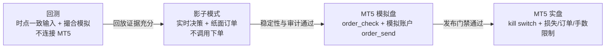

# 架构健康评审

> **文档类型**：架构健康检查（持续维护，非一次性验收）  
> **索引**：[review-index.md](../records/reviews/review-index.md) · 发现项状态见 [findings-status.md](../records/reviews/findings-status.md)（仅 F-* 金融项） · [持续审核蓝图](../../management/audit-plan.md)

本文从可读性、边界和臃肿度审视当前项目。它不是 roadmap；只记录“现在的结构是否健康”。

交易可靠性、LLM 决策链、回放证据及发布门禁的长期审核方法，见[交易分析系统持续审核蓝图](../../management/audit-plan.md)。

## 总体判断

项目功能已经明显超过一个简单 Streamlit 报告工具，当前更接近“研究 + 决策 + 回测 + 执行”的交易实验平台。模块数量偏多，但大多数复杂度来自真实需求：多数据源、LLM 双轨、审计 UI、回测、未来 MT5 执行。主要问题不是代码绝对臃肿，而是边界需要持续保持清楚。

## 分层评审

| 层 | 当前状态 | 判断 |
|----|----------|------|
| 数据层 | TradingView K 线 + 外部新闻/宏观/社媒 | 必须保留；MT5 不应进入行情路径 |
| 指标/结构层 | indicators + ICT/PA 启发式 | 必须保留；后续可独立标准化 ICT interpreter |
| Agent 层 | rule agents + factory 调度 | 必须保留；factory 已是关键边界 |
| LLM 层 | stages + payload + schemas + transport | 必须保留；schema/fallback 是安全边界 |
| 回测层 | replay infra + rule baseline | 必须保留；需扩展 full LLM replay |
| 执行层 | MT5 account bridge | 应延后下单；先做 `order_check` 与 shadow |
| UI 层 | Streamlit report + decision audit | 必须保留；可继续压缩默认视图 |

## 可合并或延后

- `docs/aspice/records/reviews/` 中历史金融/GUI 评审只保留引用，不参与当前架构判断。
- GitHub issue 批量脚本属于维护工具，可保留但不应出现在 owner 主路径。
- GUI 细节验收应进入测试/归档，不再放 roadmap。
- MT5 order_send 应延后到 shadow 和 order_check 稳定之后。

## 关键边界

四种运行模式是逐级放开的安全边界，而不是可以任意切换的同级选项：

任一级证据不足都必须停留在当前级；实盘不能绕过影子模式和模拟盘验证。

## 结论

当前架构可继续演进，不建议大规模重写。优化重点应放在：

1. 让文档权威来源清楚。
2. 让测试分层和输出边界清楚。
3. 让回测、shadow、paper、live 的运行模式清楚。
4. 后续代码重构只围绕真实痛点，不为了“看起来轻”而削掉审计能力。
