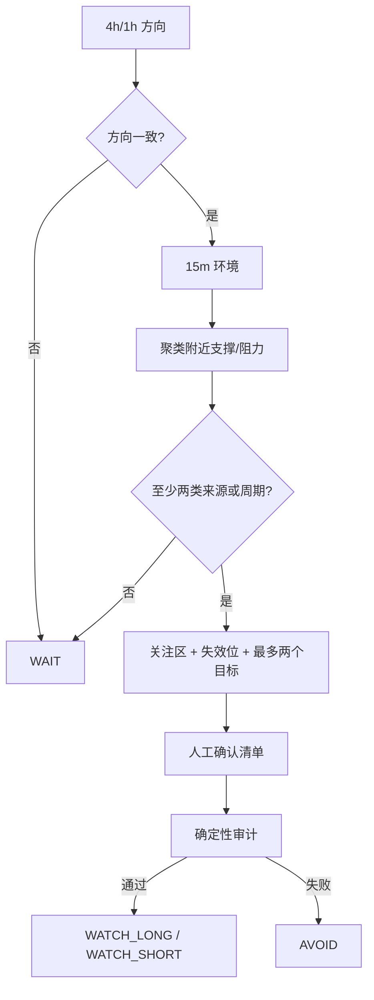
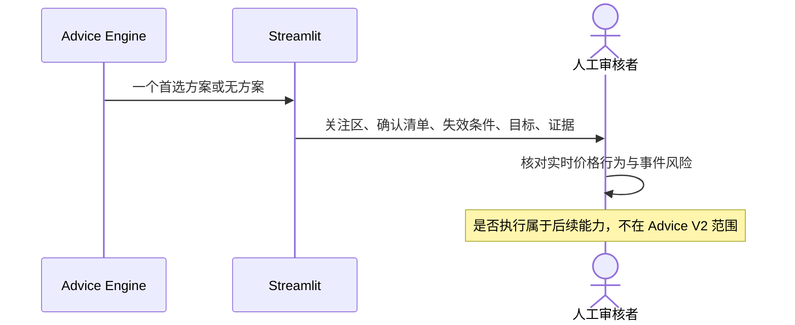

# 人工审核交易建议架构

## 决策语义

| 决策 | 含义 |
|---|---|
| `WATCH_LONG` | 高周期偏多，附近存在多源共振支撑，只等待人工确认做多条件。 |
| `WATCH_SHORT` | 高周期偏空，附近存在多源共振阻力，只等待人工确认做空条件。 |
| `WAIT` | 数据可用，但方向、共振或目标空间不足。 |
| `AVOID` | 数据时效或候选建议审计不合格，本次不形成建议。 |

## 建议形成

关注区来自结构水平聚类。新闻、日历、DXY 和收益率只形成背景风险，不直接创造价格点位。

## 人工确认边界

一个有效首选方案必须包含：方向、关注区、当前状态、理由、可观察确认清单、失效条件和数值、1–2 个目标、证据 ID、目标风险收益比，以及一个不自动反手的替代场景。

## LLM 边界

LLM 是可选编辑器，不是决策者。传入模型的是完整确定性建议，输出只接收 `summary`、`market_context`、`rationale`、`confirmation_checklist`、`risks` 和 `uncertainties`。任何新价格、新方案、格式失败或审计失败都会回退到确定性文案。

默认受控配置使用硅基流动 `deepseek-ai/DeepSeek-V4-Flash`；直连 DeepSeek 官方 API 时可通过 `LLM_THINKING` 控制 V4 thinking 模式。`meta.generation_steps`、`meta.llm_io` 与 `advisor_trace` 在 **LLM 思考过程** 页与生成等待面板中展示，供人工审计，不构成新的交易决策。
