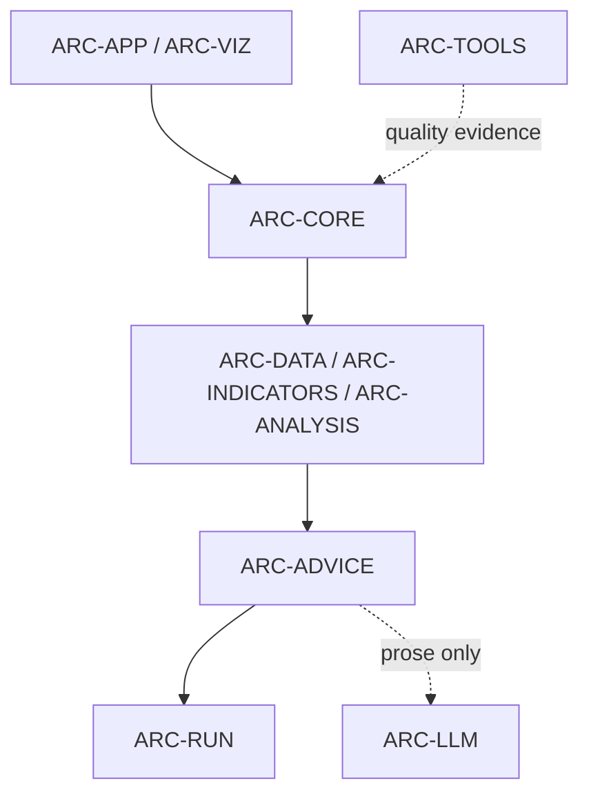
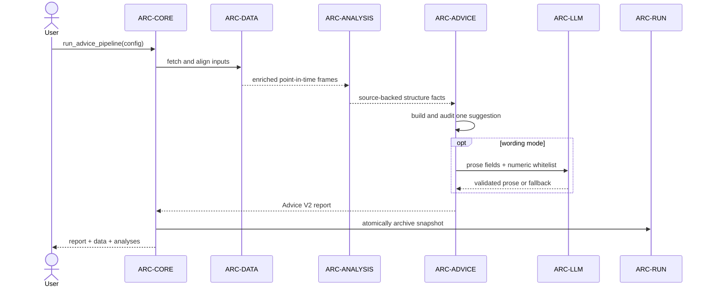
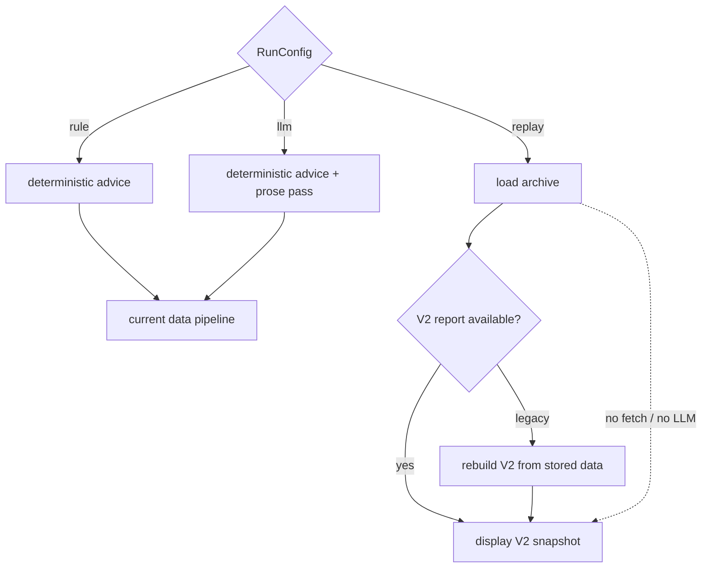
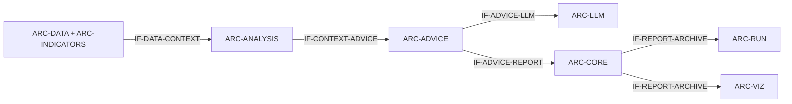

# SWE.2 软件架构设计

| 属性 | 内容 |
|---|---|
| ASPICE 过程 | SWE.2 |
| 状态 | 受控基线 |
| 用途 | 评审组件职责、接口和运行模式 |

> 本文是人工阅读、评审和变更讨论的正式入口。结构化校验数据位于
> `_machine/`，普通评审无需直接阅读机器文件。

## 架构总览

| 组件 | 名称 | 软件单元 | 职责 |
|---|---|---|---|
| ARC-APP | Application entry and run selection | 5 | Starts Streamlit, selects deterministic, wording or replay mode, and owns session-level generation state. |
| ARC-CORE | Advice pipeline orchestration | 12 | Orders fetch, indicators, structure, advice, report and archive stages and publishes progress and audit metadata. |
| ARC-DATA | Market and external data | 30 | Acquires, normalizes and aligns market and external inputs while preserving source, error and as-of semantics. |
| ARC-INDICATORS | Technical indicator enrichment | 3 | Computes reproducible technical columns and input-quality snapshots from timeframe OHLCV frames. |
| ARC-ANALYSIS | Point-in-time market structure | 12 | Derives PA/ICT structure, support, resistance, liquidity and freshness facts without creating a trade authorization. |
| ARC-ADVICE | Human-review advice engine | 6 | Reduces source-backed facts to one watch setup or an explicit WAIT/AVOID result, audits geometry and composes artifact version 2. |
| ARC-LLM | Optional advice wording service | 7 | Calls one configured model with bounded retry and budget policy, validates prose-only output and records telemetry. |
| ARC-RUN | Run configuration and archives | 12 | Binds immutable run configuration, atomically persists Advice V2 bundles and reconstructs V2 from compatible legacy data. |
| ARC-VIZ | Human-review presentation | 12 | Presents the compact advice, evidence, audit, uncertainty, external context, LLM generation telemetry and replay state without execution controls. |
| ARC-TOOLS | Development and ASPICE tooling | 15 | Runs connection diagnostics, archive inspection, sample export and deterministic ASPICE generation and validation. |

## 模块分层图

## 核心依赖主干图

## 主流水线时序图

## 运行模式与回放边界图

## 跨组件接口流向图

## 运行模式

| 模式 | 行为 |
|---|---|
| MODE-DETERMINISTIC | Generate Advice V2 entirely from reproducible market facts and deterministic policy. |
| MODE-LLM-WORDING | Generate deterministic Advice V2 first, then permit one constrained prose-only LLM pass. |
| MODE-REPLAY | Load or reconstruct Advice V2 from an archive without new supplier or LLM calls. |

## ARC-APP

**名称**：Application entry and run selection

| 属性 | 内容 |
|---|---|
| 源码范围 | app.py、run_app.py、views/** |
| 接口规格 | [application entry](#arc-app-if-01) |
| 动态行为 | Starts Streamlit, selects deterministic, wording or replay mode, and owns session-level generation state. |
| 关联需求 | [SWR-CORE-002](../SWE.1-software-requirements.md#swr-core-002)、[SWR-UI-001](../SWE.1-software-requirements.md#swr-ui-001)、[SWR-CFG-001](../SWE.1-software-requirements.md#swr-cfg-001) |
| 详细设计 | [查看 5 个软件单元](../SWE.3-detailed-design/ARC-APP.md) |

### ARC-APP-IF-01

**接口名称**：`application entry`

| 属性 | 说明 |
|---|---|
| 接口类型 | 命令行接口 |
| 作用 | Start the controlled Streamlit process and select a run configuration. |
| 输入参数 | Optional port plus environment-backed configuration and Streamlit session state. |
| 输出 / 返回 | Running application process and selected immutable RunConfig. |
| 失败 / 异常行为 | Missing runtime dependency or invalid configuration is reported before pipeline execution. |

## ARC-CORE

**名称**：Advice pipeline orchestration

| 属性 | 内容 |
|---|---|
| 源码范围 | src/core/**、src/pipeline.py |
| 接口规格 | [run_advice_pipeline](#arc-core-if-01) |
| 动态行为 | Orders fetch, indicators, structure, advice, report and archive stages and publishes progress and audit metadata. |
| 关联需求 | [SWR-CORE-001](../SWE.1-software-requirements.md#swr-core-001)、[SWR-CORE-002](../SWE.1-software-requirements.md#swr-core-002)、[SWR-REP-001](../SWE.1-software-requirements.md#swr-rep-001)、[SWR-ARC-001](../SWE.1-software-requirements.md#swr-arc-001)、[SWR-NFR-002](../SWE.1-software-requirements.md#swr-nfr-002) |
| 详细设计 | [查看 12 个软件单元](../SWE.3-detailed-design/ARC-CORE.md) |

### ARC-CORE-IF-01

**接口名称**：`run_advice_pipeline`

| 属性 | 说明 |
|---|---|
| 接口类型 | 函数接口 |
| 作用 | Execute the complete Advice V2 production sequence. |
| 输入参数 | Thread-local RunConfig and optional ProgressReporter. |
| 输出 / 返回 | Advice V2 report, enriched timeframe frames and timeframe analyses. |
| 失败 / 异常行为 | Stage failure is published and archived; no fabricated success report is returned. |

## ARC-DATA

**名称**：Market and external data

| 属性 | 内容 |
|---|---|
| 源码范围 | src/data/** |
| 接口规格 | [MarketContext](#arc-data-if-01) |
| 动态行为 | Acquires, normalizes and aligns market and external inputs while preserving source, error and as-of semantics. |
| 关联需求 | [SWR-CORE-001](../SWE.1-software-requirements.md#swr-core-001)、[SWR-DATA-001](../SWE.1-software-requirements.md#swr-data-001)、[SWR-DATA-002](../SWE.1-software-requirements.md#swr-data-002)、[SWR-DATA-003](../SWE.1-software-requirements.md#swr-data-003)、[SWR-NFR-001](../SWE.1-software-requirements.md#swr-nfr-001) |
| 详细设计 | [查看 30 个软件单元](../SWE.3-detailed-design/ARC-DATA.md) |

### ARC-DATA-IF-01

**接口名称**：`MarketContext`

| 属性 | 说明 |
|---|---|
| 接口类型 | 数据接口 |
| 作用 | Transfer aligned market and external input with source and quality metadata. |
| 输入参数 | Enriched frames, timeframe analyses, metrics, current price, external factors and source label. |
| 输出 / 返回 | Frozen context consumed by the advice engine. |
| 失败 / 异常行为 | Missing or stale inputs retain explicit status rather than masquerading as current facts. |

## ARC-INDICATORS

**名称**：Technical indicator enrichment

| 属性 | 内容 |
|---|---|
| 源码范围 | src/indicators/** |
| 接口规格 | [enrich](#arc-indicators-if-01) |
| 动态行为 | Computes reproducible technical columns and input-quality snapshots from timeframe OHLCV frames. |
| 关联需求 | [SWR-ANA-001](../SWE.1-software-requirements.md#swr-ana-001) |
| 详细设计 | [查看 3 个软件单元](../SWE.3-detailed-design/ARC-INDICATORS.md) |

### ARC-INDICATORS-IF-01

**接口名称**：`enrich`

| 属性 | 说明 |
|---|---|
| 接口类型 | 函数接口 |
| 作用 | Add deterministic technical columns to one OHLCV frame. |
| 输入参数 | Time-ordered OHLCV DataFrame. |
| 输出 / 返回 | DataFrame with configured technical indicators. |
| 失败 / 异常行为 | Invalid columns or insufficient rows remain visible through exceptions or readiness notes. |

## ARC-ANALYSIS

**名称**：Point-in-time market structure

| 属性 | 内容 |
|---|---|
| 源码范围 | src/analysis/** |
| 接口规格 | [TimeframeAnalysis](#arc-analysis-if-01) |
| 动态行为 | Derives PA/ICT structure, support, resistance, liquidity and freshness facts without creating a trade authorization. |
| 关联需求 | [SWR-DATA-003](../SWE.1-software-requirements.md#swr-data-003)、[SWR-ANA-001](../SWE.1-software-requirements.md#swr-ana-001) |
| 详细设计 | [查看 12 个软件单元](../SWE.3-detailed-design/ARC-ANALYSIS.md) |

### ARC-ANALYSIS-IF-01

**接口名称**：`TimeframeAnalysis`

| 属性 | 说明 |
|---|---|
| 接口类型 | 数据接口 |
| 作用 | Transfer point-in-time structure and volatility facts for one timeframe. |
| 输入参数 | Trend, swings, ATR, PA/ICT structures, liquidity and volume state. |
| 输出 / 返回 | Reproducible structured analysis object. |
| 失败 / 异常行为 | Insufficient history produces neutral or explicitly unavailable facts. |

## ARC-ADVICE

**名称**：Human-review advice engine

| 属性 | 内容 |
|---|---|
| 源码范围 | src/advice/** |
| 接口规格 | [AdvicePacket](#arc-advice-if-01) |
| 动态行为 | Reduces source-backed facts to one watch setup or an explicit WAIT/AVOID result, audits geometry and composes artifact version 2. |
| 关联需求 | [SWR-CORE-001](../SWE.1-software-requirements.md#swr-core-001)、[SWR-DATA-002](../SWE.1-software-requirements.md#swr-data-002)、[SWR-DATA-003](../SWE.1-software-requirements.md#swr-data-003)、[SWR-ADV-001](../SWE.1-software-requirements.md#swr-adv-001)、[SWR-ADV-002](../SWE.1-software-requirements.md#swr-adv-002)、[SWR-ADV-003](../SWE.1-software-requirements.md#swr-adv-003)、[SWR-ADV-004](../SWE.1-software-requirements.md#swr-adv-004)、[SWR-LLM-001](../SWE.1-software-requirements.md#swr-llm-001)、[SWR-LLM-002](../SWE.1-software-requirements.md#swr-llm-002)、[SWR-REP-001](../SWE.1-software-requirements.md#swr-rep-001)、[SWR-UI-002](../SWE.1-software-requirements.md#swr-ui-002)、[SWR-NFR-001](../SWE.1-software-requirements.md#swr-nfr-001)、[SWR-NFR-002](../SWE.1-software-requirements.md#swr-nfr-002) |
| 详细设计 | [查看 6 个软件单元](../SWE.3-detailed-design/ARC-ADVICE.md) |

### ARC-ADVICE-IF-01

**接口名称**：`AdvicePacket`

| 属性 | 说明 |
|---|---|
| 接口类型 | 数据接口 |
| 作用 | Represent one falsifiable suggestion for human confirmation or an explicit no-setup decision. |
| 输入参数 | Decision, bias, confidence, setup, alternative scenario, evidence, risks, uncertainty and audit. |
| 输出 / 返回 | Versioned serializable Advice V2 payload. |
| 失败 / 异常行为 | Audit violations degrade the candidate to AVOID and preserve violations. |

## ARC-LLM

**名称**：Optional advice wording service

| 属性 | 内容 |
|---|---|
| 源码范围 | src/llm/** |
| 接口规格 | [advisor wording pass](#arc-llm-if-01) |
| 动态行为 | Calls one configured model with bounded retry and budget policy, validates prose-only output and records telemetry. |
| 关联需求 | [SWR-LLM-001](../SWE.1-software-requirements.md#swr-llm-001)、[SWR-LLM-002](../SWE.1-software-requirements.md#swr-llm-002)、[SWR-CFG-001](../SWE.1-software-requirements.md#swr-cfg-001)、[SWR-NFR-001](../SWE.1-software-requirements.md#swr-nfr-001) |
| 详细设计 | [查看 7 个软件单元](../SWE.3-detailed-design/ARC-LLM.md) |

### ARC-LLM-IF-01

**接口名称**：`advisor wording pass`

| 属性 | 说明 |
|---|---|
| 接口类型 | 服务接口 |
| 作用 | Improve only the prose fields of deterministic advice. |
| 输入参数 | Whitelisted AdvicePacket text fields and immutable numeric context. |
| 输出 / 返回 | Validated prose plus LLMStageTrace, or deterministic fallback. |
| 失败 / 异常行为 | Transport, JSON, budget, invented-price or audit failure retains deterministic wording. |

## ARC-RUN

**名称**：Run configuration and archives

| 属性 | 内容 |
|---|---|
| 源码范围 | src/run/** |
| 接口规格 | [archive bundle](#arc-run-if-01) |
| 动态行为 | Binds immutable run configuration, atomically persists Advice V2 bundles and reconstructs V2 from compatible legacy data. |
| 关联需求 | [SWR-CORE-001](../SWE.1-software-requirements.md#swr-core-001)、[SWR-CORE-002](../SWE.1-software-requirements.md#swr-core-002)、[SWR-REP-001](../SWE.1-software-requirements.md#swr-rep-001)、[SWR-ARC-001](../SWE.1-software-requirements.md#swr-arc-001)、[SWR-ARC-002](../SWE.1-software-requirements.md#swr-arc-002)、[SWR-CFG-001](../SWE.1-software-requirements.md#swr-cfg-001)、[SWR-NFR-002](../SWE.1-software-requirements.md#swr-nfr-002)、[SWR-NFR-004](../SWE.1-software-requirements.md#swr-nfr-004) |
| 详细设计 | [查看 12 个软件单元](../SWE.3-detailed-design/ARC-RUN.md) |

### ARC-RUN-IF-01

**接口名称**：`archive bundle`

| 属性 | 说明 |
|---|---|
| 接口类型 | 数据接口 |
| 作用 | Persist and reload reproducible pipeline inputs, outputs and status. |
| 输入参数 | Manifest, RunConfig, report, fetch snapshot, enriched data and analyses. |
| 输出 / 返回 | Validated archive bundle or explicit compatibility diagnosis. |
| 失败 / 异常行为 | Atomic failure archive is written where possible; incompatible legacy advice is not displayed. |

## ARC-VIZ

**名称**：Human-review presentation

| 属性 | 内容 |
|---|---|
| 源码范围 | src/viz/** |
| 接口规格 | [render_advice](#arc-viz-if-01) |
| 动态行为 | Presents the compact advice, evidence, audit, uncertainty, external context, LLM generation telemetry and replay state without execution controls. |
| 关联需求 | [SWR-ADV-002](../SWE.1-software-requirements.md#swr-adv-002)、[SWR-ADV-004](../SWE.1-software-requirements.md#swr-adv-004)、[SWR-ARC-002](../SWE.1-software-requirements.md#swr-arc-002)、[SWR-UI-001](../SWE.1-software-requirements.md#swr-ui-001)、[SWR-UI-002](../SWE.1-software-requirements.md#swr-ui-002) |
| 详细设计 | [查看 12 个软件单元](../SWE.3-detailed-design/ARC-VIZ.md) |

### ARC-VIZ-IF-01

**接口名称**：`render_advice`

| 属性 | 说明 |
|---|---|
| 接口类型 | 展示接口 |
| 作用 | Present the decision contract and the facts needed for manual confirmation. |
| 输入参数 | Advice V2 report and session/replay state. |
| 输出 / 返回 | Streamlit advice, evidence, risk, audit and external-data components. |
| 失败 / 异常行为 | Missing optional sections degrade to explanatory empty state rather than execution controls. |

## ARC-TOOLS

**名称**：Development and ASPICE tooling

| 属性 | 内容 |
|---|---|
| 源码范围 | scripts/** |
| 接口规格 | [quality evidence CLI](#arc-tools-if-01) |
| 动态行为 | Runs connection diagnostics, archive inspection, sample export and deterministic ASPICE generation and validation. |
| 关联需求 | [SWR-NFR-003](../SWE.1-software-requirements.md#swr-nfr-003)、[SWR-NFR-004](../SWE.1-software-requirements.md#swr-nfr-004) |
| 详细设计 | [查看 15 个软件单元](../SWE.3-detailed-design/ARC-TOOLS.md) |

### ARC-TOOLS-IF-01

**接口名称**：`quality evidence CLI`

| 属性 | 说明 |
|---|---|
| 接口类型 | 命令行接口 |
| 作用 | Generate and validate controlled software evidence and sample artifacts. |
| 输入参数 | Read-only repository inputs plus write or check mode. |
| 输出 / 返回 | Controlled docs/aspice outputs and process exit status. |
| 失败 / 异常行为 | Stale, missing or inconsistent assets return non-zero without altering product behavior. |

## 组件接口

## IF-DATA-CONTEXT

| 属性 | 说明 |
|---|---|
| 提供者 | ARC-DATA、ARC-INDICATORS |
| 消费者 | ARC-ANALYSIS、ARC-ADVICE |
| 作用 | Supply aligned market frames, technical enrichment and external background with time semantics. |
| 输入参数 | OHLCV frames, indicators, external factors, current price and data-as-of metadata. |
| 输出 / 返回 | MarketContext-compatible point-in-time input. |
| 失败 / 异常行为 | Missing, future or stale data carries explicit quality state and triggers deterministic degradation. |
| 数据与行为契约 | Time indexes are timezone-aware and current price is anchored to the same-batch 5m close. |

## IF-CONTEXT-ADVICE

| 属性 | 说明 |
|---|---|
| 提供者 | ARC-DATA、ARC-ANALYSIS |
| 消费者 | ARC-ADVICE |
| 作用 | Transfer source-backed structure facts and candidate support/resistance levels to the advice policy. |
| 输入参数 | MarketContext, TimeframeAnalysis objects and level rows with timeframe and source. |
| 输出 / 返回 | Inputs sufficient to form one confluence-backed setup or no setup. |
| 失败 / 异常行为 | Direction conflict, isolated levels or absent targets produce WAIT; stale data produces AVOID. |
| 数据与行为契约 | Narrative external data cannot directly create entry, invalidation or target prices. |

## IF-ADVICE-LLM

| 属性 | 说明 |
|---|---|
| 提供者 | ARC-ADVICE |
| 消费者 | ARC-LLM |
| 作用 | Offer only explanatory fields for one optional constrained wording pass. |
| 输入参数 | Deterministic AdvicePacket and a whitelist of permitted numeric values. |
| 输出 / 返回 | Prose replacements and telemetry. |
| 失败 / 异常行为 | Any new setup, price, malformed payload or failed audit is rejected. |
| 数据与行为契约 | Decision, bias, confidence, direction and all numeric values are immutable. |

## IF-ADVICE-REPORT

| 属性 | 说明 |
|---|---|
| 提供者 | ARC-ADVICE |
| 消费者 | ARC-CORE、ARC-RUN、ARC-VIZ |
| 作用 | Publish one audited human-review artifact to orchestration, archive and presentation. |
| 输入参数 | AdvicePacket, MarketContext, run ID and RunConfig fingerprint. |
| 输出 / 返回 | artifact_kind human_review_advice, artifact_version 2 report. |
| 失败 / 异常行为 | A failed candidate audit cannot be published as WATCH_LONG or WATCH_SHORT. |
| 数据与行为契约 | Required sections are meta, metrics, advice, timeframes, levels and external; V1 keys are prohibited. |

## IF-REPORT-ARCHIVE

| 属性 | 说明 |
|---|---|
| 提供者 | ARC-CORE |
| 消费者 | ARC-RUN、ARC-VIZ |
| 作用 | Preserve and display the same completed report snapshot. |
| 输入参数 | Versioned report and generation metadata. |
| 输出 / 返回 | Reproducible persisted and rendered Advice V2 result. |
| 失败 / 异常行为 | Archive failure is explicit; legacy V1 narrative is never treated as active advice. |
| 数据与行为契约 | Replay performs no new supplier fetch or LLM call. |
