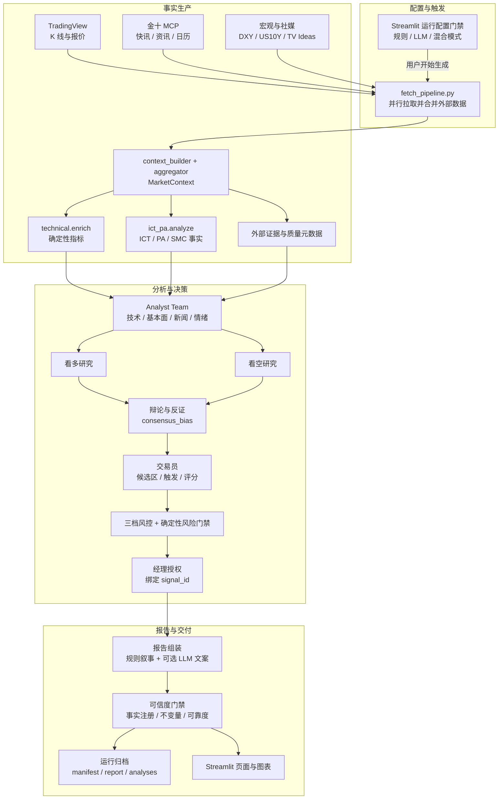
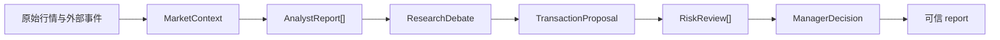

# GoldAnalysisAI 架构设计（TradingAgents 参考）

> **原则**：前端 Streamlit 不变；`run_analysis()` 仍返回 `(report, data, analyses)`。
> 内部分层按 [TradingAgents](https://github.com/TauricResearch/TradingAgents) 多智能体流水线重构。
> 软件域索引见 [software-domain.md](../software-domain.md)。

---

## 1. 与 TradingAgents 对照

| TradingAgents 模块 | GoldAnalysisAI 对应 | 当前状态 |
|-----------------|---------------------|----------|
| **Market** (Yahoo 等) | `data/fetcher.py` → TradingView OANDA:XAUUSD | ✅ 已接入 |
| **Technical Analyst** | `agents/analysts/technical.py` | ✅ 规则版（EMA + ICT 结构） |
| **Fundamentals Analyst** | `agents/analysts/fundamentals.py` | ✅ 规则版（DXY + US10Y via TradingView） |
| **News Analyst** | `agents/analysts/news.py` | ✅ 规则版（金十 MCP 快讯 + 资讯 + 日历；结构化 HeadlineItem / CalendarEvent） |
| **Sentiment Analyst** | `agents/analysts/sentiment.py` | ✅ 规则版（结构投票 + TV Ideas/Minds） |
| **Bullish Researcher** | `agents/factory.py` → rule / `llm/stages/bullish` | ✅ 整合 Analyst Team 输出 |
| **Bearish Researcher** | `agents/factory.py` → rule / `llm/stages/bearish` | ✅ 整合 Analyst Team 输出 |
| **Discussion** | `agents/factory.py` → rule / `llm/stages/debate` | ✅ 双轨（P0） |
| **Trader Agent** | `agents/factory.py` → rule / `llm/stages/trader.py` | ✅ 双轨，生成交易提案 |
| **Risk Team** (激进/中性/保守) | `agents/factory.py` → rule / `llm/stages/risk.py` | ✅ 双轨，三档风控过滤 |
| **Manager** | `agents/factory.py` → rule / `llm/stages/manager.py` | ✅ 双轨，最终执行/观望决策 |
| **LLM 报告文案** | `llm/analyst.py` | ✅ 流水线末尾（`LLM_ENABLED`） |
| **流式 LLM I/O** | `viz/pipeline_progress.py` | ✅ 生成时实时展示 |
| **Execution** | 券商/MT5 API | MT5 账号连接已接入；模拟/实盘下单未接入 |
| **Streamlit UI** | `app.py` + `views/*` + `viz/*` | ✅ 三页：机构 / 短线 / LLM 决策 |

---

## 2. 数据流

下图把主链路拆成“配置、事实生产、决策、交付”四层。箭头表示数据或领域对象的传递，不表示模块可以绕过后续门禁。



关键对象在主链路中的变化如下：



**回放**（配置页选「历史回放」）：`load_replay_bundle()` 直接读归档，**不经过**上方 fetch → LLM 链路。

**报告可信度层**（事实注册、证据溯源、不变量、可靠度）见 **[report-trust.md](./report-trust.md)**（2026-07 落地，对应 daily-audit #27–#32）。

\* News / Social / Fundamentals 已接入真实数据源（金十 MCP 快讯/资讯/日历、TradingView DXY、TV Ideas/Minds）；失败时回退占位文案，UI schema 不变。

---

## 3. Analyst Team 设计

| 分析师 | 文件 | 输入 | 输出 |
|--------|------|------|------|
| Technical | `analysts/technical.py` | EMA/VWAP、ATR/RSI/MACD/ADX、ICT 多周期结构、Fib、支撑阻力、技术输入质量 | `AnalystReport(bias, items, summary)` |
| Fundamentals | `analysts/fundamentals.py` | DXY / US10Y、宏观日历、事件倒计时、来源覆盖 | 黄金多空宏观偏向 |
| News | `analysts/news.py` | 金十 MCP 快讯 + 资讯 + 日历、新闻主题、渠道密度 | 波动/事件风险（通常 neutral） |
| Sentiment | `analysts/sentiment.py` | 结构情绪投票 + TV Ideas/Minds、社媒样本质量 | 短期情绪偏向 |

**类型**（`core/types.py`）：

- `AnalystReport` — 单个分析师报告（含 `bias: bullish|bearish|neutral`）
- `AnalystTeam` — 四个报告容器，`to_dict()` 写入 `agent_trace.analyst_team`
- `MarketContext.context_stats` — 写入技术输入和分角色输入密度，供报告 meta、LLM payload 与调试审计使用
- `analysis/technical_context.py` — 共享技术上下文，供规则技术分析师、LLM 技术分析师 payload 与最终报告文案层复用
- `analysis/luxalgo_smc.py` + `analysis/dgt_price_action.py` — Lux SMC 结构与 DGT 量价检测
- `analysis/narrative_sections.py` + `analysis/narrative_combine.py` — 报告五块规则文案与 PA/SMC 合并
- `analysis/fact_registry.py` — 统一事实注册表（`report.meta.fact_registry`）
- `analysis/report_invariants.py` / `report_reliability.py` — 归档前确定性门禁与可靠度
- `agents/analysts/evidence_provenance.py` — Research/Debate 证据 ID 白名单与溯源元数据
- `analysis/field_glossary.py` — PA/SMC 字段释义与各场景提示词主次

技术分析分层（检测 / 事实 / 文案 / 主图裁剪）见 [technical-analysis.md](./technical-analysis.md)；叙事组合见 [smc-pa-narrative.md](./smc-pa-narrative.md)。

**研究员整合**（`bullish.py` / `bearish.py`）：

- 保留原有 ICT 结构证据提取
- 通过 `items_for_direction()` 并入 Analyst Team 中**同向**证据
- 辩论阶段在 `discussion_notes` 开头输出四位分析师摘要

---

## 4. 目录结构

```
src/
├── core/
│   ├── types.py          # AnalystReport, AnalystTeam, AgentTrace…
│   ├── progress.py       # 生成步骤 + stage_io / llm_io 记录
│   └── orchestrator.py   # run_trade_agent_pipeline()
├── agents/
│   ├── factory.py          # 统一调度 rule / llm / hybrid
│   ├── analysts/           # ← Analyst Team（新增）
│   │   ├── technical.py
│   │   ├── fundamentals.py
│   │   ├── news.py
│   │   ├── sentiment.py
│   │   └── base.py
│   ├── bullish.py / bearish.py / debate.py
│   ├── trader.py / risk.py / manager.py
│   └── llm/stages/         # LLM 各阶段（payload 含 analyst_team）
├── data/
│   ├── fetch_pipeline.py   # K 线 + 外部源统一拉取（orchestrator 入口）
│   ├── context_builder.py  # derived 信号 + context_stats
│   ├── aggregator.py       # merge_external → MarketContext
│   └── sources/
│       ├── jin10_mcp_client.py  # 金十 MCP 传输（JSON-RPC / SSE）
│       ├── jin10_feed.py        # 快讯 + 资讯 + 日历 bundle
│       ├── gold_relevance.py    # 黄金相关筛选
│       ├── macro.py             # DXY + US10Y quotes
│       ├── news.py              # NewsDataSource
│       ├── fundamentals.py      # 宏观 DataSource
│       ├── social_feed.py       # TV Ideas/Minds
│       └── market.py            # TradingView OHLCV
├── analysis/
│   ├── fact_registry.py       # 事实注册表 fr-v2
│   ├── report_invariants.py   # 跨板块不变量
│   ├── report_reliability.py  # 确定性可靠度
│   ├── data_freshness.py      # data_as_of / observation_mode
│   └── price_action_facts.py  # Session PA（1d open 锚定）
├── indicators/
├── viz/
└── pipeline.py
```

---

## 5. 对外接口（不变）

```python
from src.pipeline import run_analysis

report, data, analyses = run_analysis()
# 新增可选字段：
# report["agent_trace"]["analyst_team"]  # 四位分析师报告
# report["agent_trace"]["stage_meta"]    # 各阶段 rule/llm 来源
# report["meta"]["run_config"]           # UI 选择的本次运行配置
```

---

## 6. 运行配置边界

Streamlit 首屏先展示运行配置，用户确认后再触发数据拉取与分析。后台 worker 通过 `apply_run_config()` 将不可变 `RunConfig` 绑定到当前线程的 `ContextVar`（`src/core/run_context.py`），`factory` 等阶段通过 `get_run_config()` 读取，避免多会话并发时模块全局被覆盖。

报告生成状态按 `session_id + generation_id` 隔离（`src/viz/generation_state.py`），经理授权与 `position_scale` 在 `apply_manager_authorization()` 中一次性写入报告，不再由 orchestrator 二次覆盖。

---

## 7. 交易信号合同

交易信号兼容四种状态：

| 状态 | 含义 |
|------|------|
| `candidate` | 候选交易区，仅观察 |
| `watch` | 价格接近候选区，等待触发确认 |
| `active` | 触发条件已满足，可作为执行计划 |
| `invalid` | 几何、方向或结构条件失效 |

`TradingSignal` 保持旧字段兼容，同时包含：

- `setup_type`
- `status`
- `trigger_confirmed`
- `trigger_note`
- `claim_id` / `claim_eligibility` / `claim_fact_ids` / `claim_quality` / `counterevidence`
- `score_total`
- `score_grade`
- `score_reasons`

Manager 写入 `meta.plan_authorized` 与 `meta.execution_authorized`（后者对齐 `execution_ready`）：未触发或主张非 `core_execution` 时只保留条件计划。详见 [report-trust.md](./report-trust.md) §5.1–5.2。

完整 LLM 设计见 **[llm-agents.md](./llm-agents.md)**。

---

## 8. 执行层

### 8.1 LLM 点位层

保留原有研究链路：

```text
Analyst Team -> Bullish/Bearish Researchers -> Debate
```

在 Debate 之后新增面向执行的点位层：

```text
Rule candidate signals -> LLM Level Proposer -> Level Validator -> Trader
```

`LLM Level Proposer` 让模型基于已有证据提出具体 entry/stop/target。`Level Validator` 保持确定性校验，只把有效建议转换成现有 `TradingSignal` 类型。这是 LLM 点位与当前 Trader/Risk/UI 框架的嵌合点。

主要代码路径：

- `src/agents/llm/stages/levels.py`
- `src/agents/llm/payload.py::level_proposer_payload`
- `src/agents/llm/schemas.py::parse_level_proposals`
- `src/analysis/level_validator.py::validate_llm_levels`
- `src/core/orchestrator.py` between Debate and Trader

### 8.2 流动性质量层

流动性现在作为证据层处理，而不是独立的交易指令。

```text
Swings + ATR -> Liquidity zones -> Sweep quality -> TradingSignal status/score
```

实施边界：

1. `ict_pa.py` 负责确定性市场结构输入：swing、ATR、最近高低收盘和流动性区。
2. `report_engine.py` 负责执行就绪度：sweep long 必须同时满足扫穿深度、收盘收回和 bullish BOS/CHoCH。
3. `TradingSignal.score_reasons` 承载可审计原因，供 UI 和 LLM 决策链展示。
4. LLM 点位可以引用流动性证据，但是否接受、降级或拒绝仍由确定性校验决定。

这不会替换现有的 Analyst Team -> Bull/Bear -> Debate 架构。流动性层同时服务规则候选信号和 LLM 点位上下文，但不替代研究智能体。

金融侧验收见 [financial-review.md](../records/reviews/financial/static-code-review.md#2026-06-21-流动性可靠性验收口径)，后续计划见 [roadmap.md](../../management/roadmap.md#流动性质量专项)。

---

## 10. Run Archive 与历史回放

每次 **实时生成** 结束后，`orchestrator` 通过 `finalize_pipeline_archive()` 将完整结果写入 `.cache/run_archives/<run_id>/`：

| 文件 | 内容 |
|------|------|
| `manifest.json` | schema v2 契约入口 |
| `report.json` | 完整报告（含 LLM 文案） |
| `enriched/*.json` | 各周期 K 线 + 指标 |
| `analyses.json` | ICT 结构分析 |
| `fetch.json` | 原始拉数快照（可选回放外部数据） |
| `index.json` | 全局索引（加速 list，避免扫盘） |

**回放路径**（0 token · 不重跑 LLM）：

```text
Streamlit 回放模式 → load_replay_bundle() → inspect + load_bundle → UI
```

与实时路径对比：

```text
Live:  RunConfig → orchestrator → archive_run → UI
Replay: RunConfig(replay) → load_replay_bundle → UI（零计算）
```

兼容层：`run_archive_schema` → `run_archive_compat`（inspect / migrate / normalize_report）。
保留策略：`RUN_ARCHIVE_MAX_COUNT` / `RUN_ARCHIVE_MAX_MB`（LRU 清理）。
CLI：`python scripts/inspect_archive.py list|inspect|validate <run_id>`。
回测对齐：`backtest.engine.run_backtest_from_archive(run_id)` 读取同一 `fetch.json` 5m 数据。

详见 [run-archive-schema.md](../SWE.3-detailed-design/reference/run-archive-schema.md)。

---

## 11. 调试 agent_trace

```python
report, _, _ = run_analysis()
team = report["agent_trace"]["analyst_team"]
print(team["technical"]["summary"])
print(team["fundamentals"]["bias"])
print(report["agent_trace"]["debate"]["discussion_notes"])
```

可在 Streamlit「LLM决策链」页查看：
- **智能体决策** — Analyst Team 四列 + 辩论/风控/经理
- **生成与 LLM I/O** — 生成中见 **LLM 实时推理**；完成后见 `analyst_team` 规则 I/O + LLM 阶段整理摘要

---

## 2026-06-23 更新摘要

| 主题 | 说明 |
|------|------|
| **纯 LLM 模式** | `AGENT_MODE=llm` 且 LLM 阶段成功时，不再强制回退规则 baseline（修复并行 LLM 引入的 `assert rule_* is not None`） |
| **实时可观测** | 等待页轻量进度（1s 轮询 + LLM 字符计数）；完整 I/O 见生成后「LLM 决策链」 |
| **止损失效** | 现价已越过止损/失效价时，信号标为 `invalid`；`build_strategy_plans` 与 Trader 跳过 invalid 方案 |
| **配置加载** | `.env` 覆盖进程内已有环境变量，避免旧 Streamlit 进程残留错误密钥 |

---
