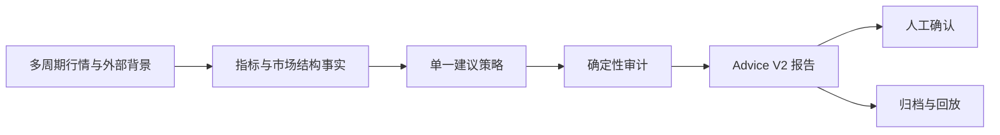
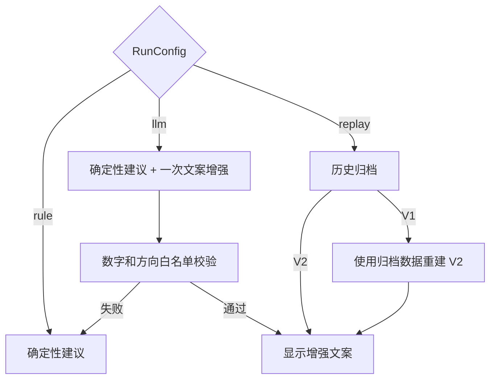

# Advice V2 系统概览

GoldAnalysisAI 当前目标不是自动交易，而是生成一份可由人审核、证伪和确认的 XAUUSD 交易建议。V1 的多 Agent 辩论、Trader/Risk/Manager 授权链和多方案报告已经退役。

## 主链路

```mermaid
flowchart LR
  A[多周期行情与外部背景] --> B[指标与市场结构事实]
  B --> C[单一建议策略]
  C --> D[确定性审计]
  D --> E[Advice V2 报告]
  E --> F[人工确认]
  E --> G[归档与回放]
```

输出只有四种决策：`WAIT`、`WATCH_LONG`、`WATCH_SHORT`、`AVOID`。`WATCH_*` 最多包含一个首选方案；系统不生成执行授权，也不调用交易接口。

## 运行模式

```mermaid
flowchart TD
  C{RunConfig} -->|rule| R[确定性建议]
  C -->|llm| L[确定性建议 + 一次文案增强]
  C -->|replay| P[历史归档]
  L --> V[数字和方向白名单校验]
  V -->|通过| O[显示增强文案]
  V -->|失败| R
  P -->|V2| O
  P -->|V1| B[使用归档数据重建 V2]
  B --> O
```

LLM 只能编辑解释文字，不能修改方向、置信等级、关注区、失效位或目标位。历史 V1 报告不会作为当前建议直接显示。

## 稳定入口

`src.pipeline.run_analysis()` 仍返回 `(report, data, analyses)`，但 `report` 已切换到 `artifact_kind=human_review_advice`、`artifact_version=2`。

详细契约见 [human-review-advice.md](./human-review-advice.md) 和 [report-schema.md](../SWE.3-detailed-design/reference/examples/report-schema.md)。
