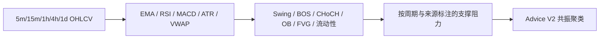

# 技术分析与结构事实

技术层只生产可复算事实，不直接生产交易执行信号。

主要约束：

- 当前价格使用同批 5m 最新收盘价；1d 只作高周期背景。
- 所有结构计算仅使用当前时间截点及以前的数据。
- 4h 和 1h 决定方向背景，15m 描述上下文，5m 只用于人工确认提示。
- 单个孤立水平不足以形成建议；关注区要求跨来源或跨周期共振。
- 数据陈旧时不生成首选方案，Advice V2 返回 `AVOID`。

实现入口是 `src/indicators/technical.py`、`src/analysis/ict_pa.py` 和 `src/analysis/technical_context.py`；建议策略位于 `src/advice/engine.py`。
