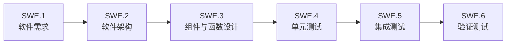

# Automotive SPICE 软件域

本目录是软件需求、架构、详细设计和验证证据的唯一权威入口。普通评审只阅读本页列出的主文档，不需要进入 `_machine/`。

## 主追踪链

| 顺序 | 过程 | 唯一入口 | 主要内容 |
|---|---|---|---|
| 1 | SWE.1 | [软件需求分析](SWE.1-software-requirements.md) | 需求、来源、优先级、接受准则、架构与验证链接 |
| 2 | SWE.2 | [软件架构设计](SWE.2-architecture/software-architecture.md) | 组件、接口、数据流、运行模式和架构专题 |
| 3 | SWE.3 | [软件详细设计](SWE.3-detailed-design/software-detailed-design.md) | 按组件拆分的软件单元和逐函数设计 |
| 4 | SWE.4 | [单元测试](SWE.4-unit-testing.md) | 单元风险、测试选择、动态测试和结果 |
| 5 | SWE.5 | [集成测试](SWE.5-integration-testing.md) | 集成顺序、接口、桩、资源、用例和结果 |
| 6 | SWE.6 | [验证测试](SWE.6-validation-testing.md) | 需求覆盖、接受结果和发布结论 |

跨过程总览：[需求—架构—验证追溯](traceability.md)。

## 支撑入口

| 内容 | 入口 |
|---|---|
| 软件配置管理 | [SUP.8 配置管理](SUP.8-configuration-management.md) |
| 文档维护规则 | [文档治理策略](governance/document-policy.md) |
| 软件域范围和关闭条件 | [范围与关闭准则](governance/scope-and-closure.md) |
| 验证策略 | [验证策略](governance/verification-strategy.md) |
| 最新验证结果 | [当前验证基线](records/verification/latest.md) |
| 历史审核记录 | [审核记录](records/reviews/review-index.md) |

## 目录边界

- `SWE.2-architecture/`：当前架构事实及专题，不再维护外部平行架构目录。
- `SWE.3-detailed-design/`：一个入口、一个组件一份生成型函数设计；`reference/` 保存 schema 和术语参考。
- `governance/`：人工维护规则，不存放一次性审核结果。
- `records/`：按日期保存历史审核和验证证据，不作为当前设计事实。
- `_machine/`：结构化镜像、追溯表、依赖锁和生成索引；仅供自动化使用。

## 修改方式

- 需求、架构和验证策略：修改对应 Markdown，同时维护必要的结构化镜像。
- 业务函数变化：重新生成 SWE.3 组件文档和验证映射，不手改生成的函数卡片。
- 新增、删除或移动文档：重新生成文档注册表并执行全仓库链接检查。
- 正常评审不得从 `_machine/` 开始，也不得直接以 CSV/YAML 代替设计结论。
