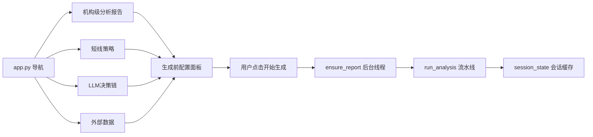
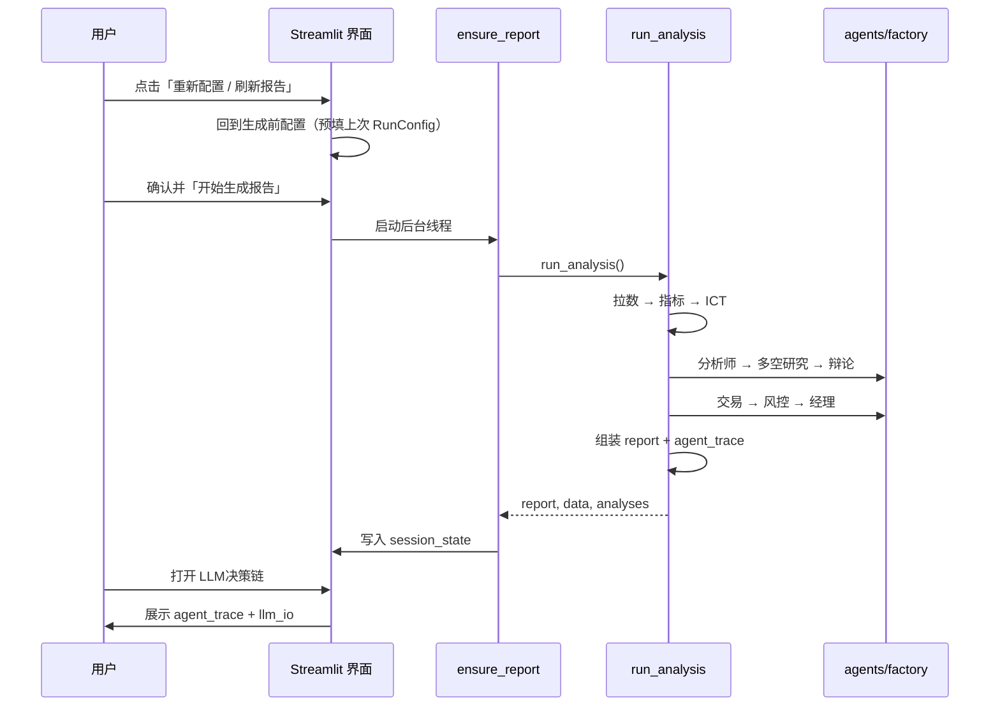

# 界面操作动线

说明：**从打开应用到读懂决策链**的完整路径。
建议与 [onboarding.md](./onboarding.md) 中的代码心智模型对照阅读。

---

## 1. 启动应用

```bash
python run_app.py
# 或 Windows: .\run_app.bat  |  Linux/macOS: ./run_app.sh
# 浏览器 http://localhost:8501
```



四个内容页共享同一份 `(report, data, analyses)`。**切换页面不会重新跑流水线**。外部数据页在 `fetch` 完成后即可通过 `ensure_external_data()` 展示，无需等待完整报告。

---

## 2. 首次进入：生成前配置

进入默认页 **机构级分析报告** 时，应用先显示 **生成前配置** 面板，不会立即拉取数据。

1. 选择 **规则引擎**、**LLM 智能体** 或 **混合模式**
2. LLM / 混合模式可选择是否启用 **LLM 报告文案**
3. 勾选 **高级调试** 后，可分别控制：分析师团队、看多/看空研究、辩论、LLM 点位提案、交易员、风控、经理，以及四位 Analyst 子模块
4. 点击 **开始生成报告** 后，才进入数据拉取与报告生成

已有报告时，侧边栏 **「重新配置 / 刷新报告」** 会清空缓存并回到本面板；面板会**预填上次确认的配置**，避免误用 `.env` 默认值。

生成开始后：

1. 页面显示 **「正在生成报告…」** 及进度
2. 步骤条按 [pipeline-steps.yaml](../reference/pipeline-steps.yaml) 顺序推进（`fetch` → `indicators` → `ict` → `analyst_team` → `bullish` → `bearish` → `debate` → `trader` → `risk` → `manager` → `report` → `llm_narrative` → `archive`）
   中文含义：数据拉取 → 技术指标 → ICT 结构 → 分析师团队 → 看多/看空 → 辩论 → 交易 → 风控 → 经理 → 报告 →（可选）LLM 文案 → **运行归档**
3. 等待期间主内容区显示 **当前进度** 与 **LLM 状态**（阶段名 + 已输出字符数）；完整 Prompt / JSON 在生成完成后于 **LLM决策链 → 生成与 I/O 审计** 查看
4. 完成后渲染机构报告，主图为 **5 分钟 K 线**（叠加近位 5 个 Internal OB 与可见范围 active FVG；远位多周期结构在关键流动性/市场总览；路径推演见底栏）

主图与多周期决策分层见 **[chart-layers.md](../architecture/chart-layers.md)**。

| 模式 | 典型耗时 |
|------|----------|
| `AGENT_MODE=rule`，未启用 LLM | 约 30 秒～2 分钟（视 TradingView 网络） |
| `AGENT_MODE=hybrid` 且全开 LLM | 约 5～6 分钟 |
| `AGENT_MODE=llm` 且全开 LLM + 报告文案 | 约 5～8 分钟（视模型与网络） |

超时与重试见 [llm-agents.md §3.4](../architecture/llm-agents.md#34-传输重试与规则兜底)（`LLM_READ_TIMEOUT`、`LLM_MAX_RETRIES` 等）。

### 历史回放（0 token）

完成任意一次生成后，配置面板会出现 **历史回放** 区块：

1. 勾选 **回放模式（0 token · 不重跑 LLM · 即时加载已保存报告）**
2. 在下拉框选择一条历史记录
3. 点击 **加载历史回放**

行为：直接读取 `.cache/run_archives/<run_id>/` 中的 `report.json` + 图表数据，**不拉 TradingView、不调用 LLM**。适合复盘某次完整 LLM 结果或对比不同模式输出。

CLI 校验：`python scripts/inspect_archive.py list|validate <run_id>`

---

## 3. 机构级分析报告页

**代码**：`views/1_机构级分析报告.py` → `viz/report_views.py`

| 区域 | 数据来源 | 说明 |
|------|----------|------|
| 顶栏指标 | `report.metrics` | 现价、日涨跌、日高/低、情绪摘要 |
| 顶栏四格 | `market_overview` / `liquidity` / `conclusion` / `sentiment` | 市场总览、流动性、结论要点、多空结构权重饼图（最右） |
| 多周期结构 | `data` + `report.timeframes` | 三列 4H/1H/15M 条带 K 线 + 结构文字（背景结构，见 [chart-layers.md](../architecture/chart-layers.md)） |
| 5 分钟主图 | `data["5m"]` + `analyses["5m"]` | K 线 + 成交量 + 近位 5 个 Internal OB / 可见范围 active FVG |
| 关键流动性 | `report.liquidity` | 近位执行区 + `参考·` 远位 swing（如不画在主图的 4H 需求区） |
| 交易计划 | `report.signals` | 右侧栏，最多 3 条计划卡片 |
| 指标校验 | 侧边栏 expander | 5m/15m：EMA/VWAP/RSI/MACD/ADX/ATR 等（供人工核对，非主图绘制） |
| 底栏四格 | `fibonacci` / `path_summary` / 风控 / `conclusion` | Fib、走势推演、失效条件、最终结论 |
| 外部数据 | `report.external`（摘要） | 完整面板见 **外部数据** 导航页 |

机构页**不再**内嵌外部数据大面板；DXY、新闻、日历、社媒与 **二次加工摘要** 见 `views/4_外部数据.py`。

**操作**：点击侧边栏 **「重新配置 / 刷新报告」** → 清空缓存 → 回到生成前配置面板（默认规则引擎，可手动切换 LLM/Hybrid）。

---

## 4. 外部数据页

**代码**：`views/4_外部数据.py` → `viz/external_data_view.py` → `ensure_external_data()`

| 内容 | 说明 |
|------|------|
| K 线拉取概况 | 各周期 bar 数 |
| DXY / 金十快讯 / 资讯 | 实时或占位 |
| 经济日历 | 事件风险 |
| TV 社媒 | Ideas/Minds |
| 二次加工摘要 | fetch 阶段仅有基础字段；完整报告生成后含 `news_topics`、spot 交叉校验等 |

**fetch 完成后**（约 10–30 秒）即可在本页查看，无需等待 LLM 或报告组装。生成过程中可从机构页切到本页等待自动刷新。

---

## 5. 短线策略页

**代码**：`views/2_短线策略.py`

- 调用 `ensure_report(show_generation_ui=False)` — 不显示生成进度（有缓存则秒开）
- 展示 5 分钟 / 15 分钟执行级策略图
- 与机构页共用同一份 report，**不会**单独生成

---

## 6. LLM决策链页（看清 AI 做了什么）

**代码**：`views/3_LLM决策链.py` → `viz/decision_page.py`

三个标签页：

### 标签页 1 — 智能体决策

展示 `report["agent_trace"]`：

```
分析师团队（四列）
    ↓
看多研究 / 看空研究
    ↓
辩论（consensus_bias 共识方向）
    ↓
交易员（proposal 提案）
    ↓
风控（激进 / 中性 / 保守 三档）
    ↓
经理（execute 执行 / reduce 减仓 / wait 观望）
```

每阶段徽章显示 **规则** 或 **LLM**，与 `meta.stage_sources` 一致。

### 标签页 2 — LLM 文案

展示 `report["llm_analysis"]`（需 `LLM_ENABLED=true`）。
这是流水线**末尾**的叙述层，与分析师团队**不是同一阶段**。

### 标签页 3 — 生成与 LLM 输入输出

**生成中**（任意等待页 / LLM决策链页）：

- **生成步骤** — 各步状态实时刷新
- **LLM 实时推理** — 当前进行中的 LLM 阶段：Prompt + 流式 JSON（后台 chunk 同步，UI 约 400ms 轮询）
- **已完成 I/O** — 已结束阶段的历史记录

**生成完成后**：

- 上方：`meta.generation_steps` — 各步耗时与状态
- 下方：`meta.llm_io` — 规则阶段输入输出 + LLM 提示词、原始 JSON 与 **整理摘要**

**调试建议**：生成时先看 Tab 3 的「LLM 实时推理」确认各阶段在跑；完成后用 Tab 1 理解决策链。

---

## 7. 序列图：刷新报告 → 查看决策链



---

## 8. 验证清单（约 5 分钟）

生成一份报告后，按顺序确认：

- [ ] `meta.generation_steps` 含 12 个步骤且均为 `done`（或 `llm_narrative` 为 `skip`）
- [ ] `agent_trace.analyst_team` 有四条记录（technical / fundamentals / news / sentiment）
- [ ] `external.sources` 标明实时源或明确的 `placeholder` 占位
- [ ] `meta.stage_sources` 与顶栏来源条一致
- [ ] 切换「外部数据」页在 fetch 完成后展示新闻/日历（无需等完整报告）
- [ ] 切换「短线策略」页在 2 秒内打开（缓存生效）
- [ ] 饼图/信号区有 **非回测** 相关说明（见 [findings-status.md](../reviews/findings-status.md) FIN-UI-01）

---

## 9. 录制演示视频（可选）

```bash
# 规则模式（更快）
# .env 中设 AGENT_MODE=rule、LLM_ENABLED=false 后执行：
python run_app.py

# 建议操作顺序：
# 重新配置 / 刷新报告 → 观察步骤条 → 外部数据页 → LLM决策链三个标签页 → 切换短线策略页

# 录屏可保存至 docs/assets/（可选，大文件可不提交仓库）
```

---

## 相关文档

| 文档 | 内容 |
|------|------|
| [onboarding.md](./onboarding.md) | 代码层心智模型 |
| [examples/report-schema.md](../reference/examples/report-schema.md) | 报告 JSON 字段 |
| [cheat-sheet.md](../reference/cheat-sheet.md) | 改界面/流水线速查 |
| [pipeline-steps.yaml](../reference/pipeline-steps.yaml) | 步骤 ID 权威列表 |

---

## 免责声明

本项目仅供学习研究，不构成投资建议。
