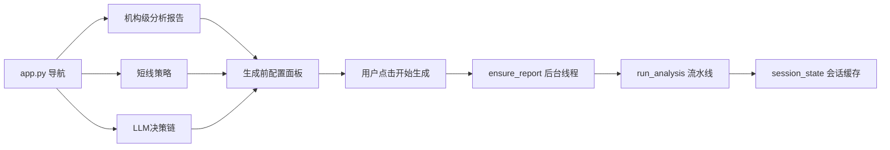
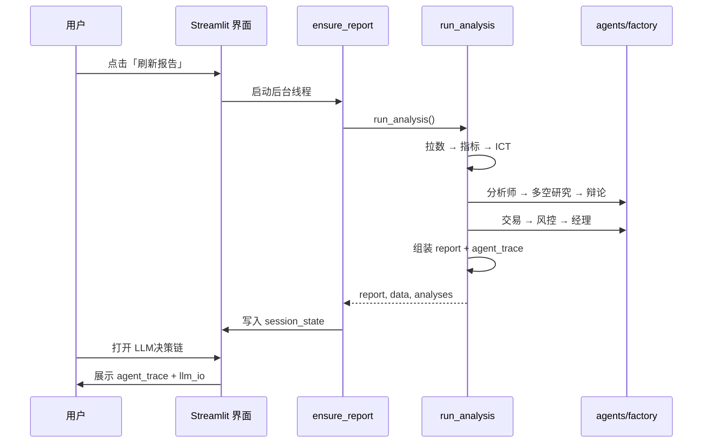

# 界面操作动线

说明：**从打开应用到读懂决策链**的完整路径。  
建议与 [developer-onboarding.md](./developer-onboarding.md) 中的代码心智模型对照阅读。

---

## 1. 启动应用

```bash
streamlit run app.py
# 浏览器打开 http://localhost:8501
```



三个页面共享同一份 `(report, data, analyses)`。**切换页面不会重新跑流水线**。

---

## 2. 首次进入：生成前配置

进入默认页 **机构级分析报告** 时，应用先显示 **生成前配置** 面板，不会立即拉取数据。

1. 选择 **规则引擎**、**LLM 智能体** 或 **混合模式**
2. LLM / 混合模式可选择是否启用 **LLM 报告文案**
3. 高级调试可选择只运行单个 Analyst LLM（其余 Analyst 用规则输出补齐）
4. 点击 **开始生成报告** 后，才进入数据拉取与报告生成

生成开始后：

1. 页面显示 **「正在生成报告…」** 及进度
2. 步骤条按 [pipeline-steps.yaml](./pipeline-steps.yaml) 顺序推进（`fetch` → `indicators` → `ict` → `analyst_team` → `bullish` → `bearish` → `debate` → `trader` → `risk` → `manager` → `report` → `llm_narrative`）  
   中文含义：数据拉取 → 技术指标 → ICT 结构 → 分析师团队 → 看多/看空 → 辩论 → 交易 → 风控 → 经理 → 报告 →（可选）LLM 文案
3. 生成过程中可切换到 **LLM决策链** 页查看实时输入输出
4. 完成后渲染机构报告，主图为 **1 日 K 线**

| 模式 | 典型耗时 |
|------|----------|
| `AGENT_MODE=rule`，未启用 LLM | 约 30 秒～2 分钟（视 TradingView 网络） |
| `AGENT_MODE=hybrid` 且全开 LLM | 约 5～6 分钟 |

---

## 3. 机构级分析报告页

**代码**：`views/1_机构级分析报告.py` → `viz/report_views.py`

| 区域 | 数据来源 | 说明 |
|------|----------|------|
| 顶栏价格/结论 | `report.metrics` + `report.conclusion` | 现价、日涨跌、一句话结论 |
| 主图 K 线 | `data["1d"]` + `analyses["1d"]` | EMA/VWAP + OB/FVG 叠加 |
| 多周期结构 | `report.timeframes` | 左侧周期卡片 |
| 情绪饼图 | `report.sentiment` | ⚠️ 结构权重，非回测胜率 |
| 交易计划卡片 | `report.signals` | 入场/止损/止盈 |
| 外部数据面板 | `report.external` | DXY、新闻、日历、社媒 |
| 来源条 | `report.meta.stage_sources` | 各阶段规则/LLM 标识 |

**操作**：点击侧边栏 **「重新配置 / 刷新报告」** → 清空缓存 → 回到生成前配置面板。

---

## 4. 短线策略页

**代码**：`views/2_短线策略.py`

- 调用 `ensure_report(show_generation_ui=False)` — 不显示生成进度（有缓存则秒开）
- 展示 5 分钟 / 15 分钟执行级策略图
- 与机构页共用同一份 report，**不会**单独生成

---

## 5. LLM决策链页（看清 AI 做了什么）

**代码**：`views/3_LLM决策链.py` → `viz/decision_page.py`

三个标签页：

### 标签页 1 — 智能体决策

展示 `report["agent_trace"]`：

```
分析师团队（四列）
    ↓
看多研究 / 看空研究
    ↓
辩论（consensus_bias 共识方向）
    ↓
交易员（proposal 提案）
    ↓
风控（激进 / 中性 / 保守 三档）
    ↓
经理（execute 执行 / reduce 减仓 / wait 观望）
```

每阶段徽章显示 **规则** 或 **LLM**，与 `meta.stage_sources` 一致。

### 标签页 2 — LLM 文案

展示 `report["llm_analysis"]`（需 `LLM_ENABLED=true`）。  
这是流水线**末尾**的叙述层，与分析师团队**不是同一阶段**。

### 标签页 3 — 生成与 LLM 输入输出

- 上方：`meta.generation_steps` — 各步耗时与状态
- 下方：`meta.llm_io` — 规则阶段输入输出 + LLM 提示词与响应

**调试建议**：生成完成后先看标签页 3 确认各步状态，再看标签页 1 理解决策链。

---

## 6. 序列图：刷新报告 → 查看决策链



---

## 7. 验证清单（约 5 分钟）

生成一份报告后，按顺序确认：

- [ ] `meta.generation_steps` 含 12 个步骤且均为 `done`（或 `llm_narrative` 为 `skip`）
- [ ] `agent_trace.analyst_team` 有四条记录（technical / fundamentals / news / sentiment）
- [ ] `external.sources` 标明实时源或明确的 `placeholder` 占位
- [ ] `meta.stage_sources` 与顶栏来源条一致
- [ ] 切换「短线策略」页在 2 秒内打开（缓存生效）
- [ ] 饼图/信号区有 **非回测** 相关说明（见 financial-review FIN-UI-01）

---

## 8. 录制演示视频（可选）

```bash
# 规则模式（更快）
AGENT_MODE=rule LLM_ENABLED=false streamlit run app.py

# 建议操作顺序：
# 刷新报告 → 观察步骤条 → LLM决策链三个标签页 → 切换短线策略页

# 录屏可保存至 docs/assets/（可选，大文件可不提交仓库）
```

---

## 相关文档

| 文档 | 内容 |
|------|------|
| [developer-onboarding.md](./developer-onboarding.md) | 代码层心智模型 |
| [examples/report-schema.md](./examples/report-schema.md) | 报告 JSON 字段 |
| [cheat-sheet.md](./cheat-sheet.md) | 改界面/流水线速查 |
| [pipeline-steps.yaml](./pipeline-steps.yaml) | 步骤 ID 权威列表 |

---

## 免责声明

本项目仅供学习研究，不构成投资建议。
