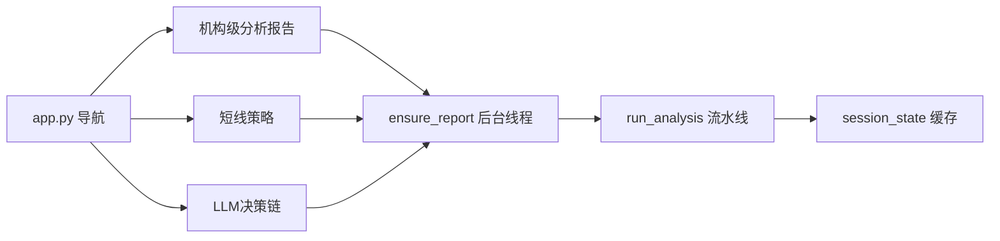
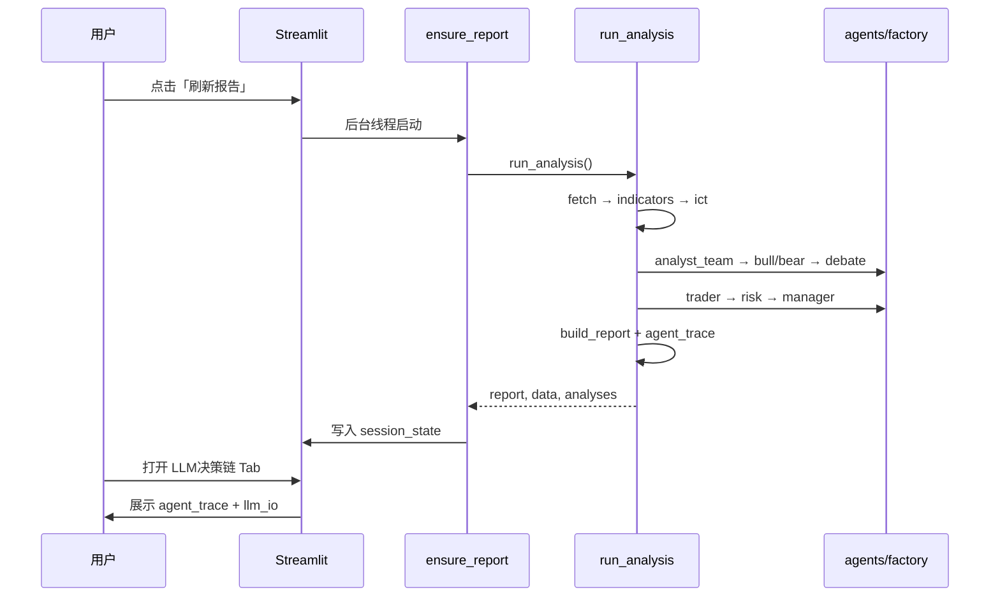

# UI 操作动线（Walkthrough）

图文说明：**从打开 App 到读懂决策链**的完整路径。  
配合 [developer-onboarding.md](./developer-onboarding.md) 的代码心智模型阅读。

---

## 1. 启动应用

```bash
streamlit run app.py
# 浏览器 → http://localhost:8501
```



三页共享同一份 `(report, data, analyses)`。**切换页面不会重跑流水线**。

---

## 2. 首次进入：报告生成

进入默认页 **机构级分析报告** 时：

1. 侧边栏出现 **「正在生成报告…」** 进度区
2. 步骤条按 [pipeline-steps.yaml](./pipeline-steps.yaml) 顺序推进：
   - 数据拉取 → 指标 → ICT → Analyst Team → 看多/看空 → 辩论 → 交易 → 风控 → 经理 → 报告 →（可选）LLM 文案
3. 生成期间可切到 **LLM决策链** 页查看实时 I/O Tab
4. 完成后机构报告主区域渲染，主图为 **1d 日线**

| 模式 | 典型耗时 |
|------|----------|
| `AGENT_MODE=rule`，无 LLM | ~30s–2min（视 TV 网络） |
| `AGENT_MODE=hybrid` + 全 LLM 阶段 | 5–6 min |

---

## 3. 机构级分析报告页

**文件**：`views/1_机构级分析报告.py` → `viz/report_views.py`

| 区域 | 数据来源 | 说明 |
|------|----------|------|
| 顶栏价格/结论 | `report.metrics` + `report.conclusion` | 现价、日涨跌、一句话结论 |
| 主图 K 线 | `data["1d"]` + `analyses["1d"]` | EMA/VWAP + OB/FVG overlay |
| 多周期结构 | `report.timeframes` | 左侧周期卡片 |
| 情绪饼图 | `report.sentiment` | ⚠️ 结构权重，非回测胜率 |
| 交易计划卡片 | `report.signals` | 入场/止损/止盈 |
| 外部数据面板 | `report.external` | DXY、新闻、日历、社媒 |
| 来源条 | `report.meta.stage_sources` | 各阶段 rule/LLM 标识 |

**操作**：点侧边栏 **「刷新报告」** → 清空缓存 → 重新跑完整流水线。

---

## 4. 短线策略页

**文件**：`views/2_短线策略.py`

- 调用 `ensure_report(show_generation_ui=False)` — **不显示**生成进度（已缓存则秒开）
- 展示 5m/15m 执行级策略图
- 与机构页共用同一份 report，**不会**单独生成

---

## 5. LLM决策链页（读懂 AI 做了什么）

**文件**：`views/3_LLM决策链.py` → `viz/decision_page.py`

三个 Tab：

### Tab 1 — 智能体决策

展示 `report["agent_trace"]`：

```
Analyst Team（四列）
    ↓
看多研究 / 看空研究
    ↓
辩论 consensus_bias
    ↓
交易员 proposal
    ↓
风控 risk_reviews（激进/中性/保守）
    ↓
经理 decision（execute / reduce / wait）
```

每阶段 badge 显示 **规则** 或 **LLM**，与 `meta.stage_sources` 一致。

### Tab 2 — LLM 文案

展示 `report["llm_analysis"]`（需 `LLM_ENABLED=true`）。  
这是流水线**末尾**的叙述层，与 Analyst Team **不是同一阶段**。

### Tab 3 — 生成与 LLM I/O

- 上方：`meta.generation_steps` — 每步耗时
- 下方：`meta.llm_io` — 规则 stage 输入输出 + LLM Prompt/响应

**调试建议**：生成完成后先看 Tab 3 确认各步 status，再看 Tab 1 理解决策链。

---

## 6. 序列图：用户刷新 → 决策链可查



---

## 7. 推荐验证清单（5 分钟）

生成一份报告后，按顺序确认：

- [ ] `meta.generation_steps` 含 12 个步骤且均为 `done`（或 llm_narrative 为 skip）
- [ ] `agent_trace.analyst_team` 有四条记录（technical/fundamentals/news/sentiment）
- [ ] `external.sources` 显示 live 源或明确的 placeholder
- [ ] `meta.stage_sources` 与顶栏来源条一致
- [ ] 切换「短线策略」页 < 2s 打开（缓存生效）
- [ ] 饼图/信号卡片有 **非回测** 相关说明（见 financial-review FIN-UI-01）

---

## 8. 录制演示视频（可选）

维护者可自行录制 walkthrough 视频：

```bash
# 1. 规则模式（更快）
AGENT_MODE=rule LLM_ENABLED=false streamlit run app.py

# 2. 操作顺序
#    刷新报告 → 观察步骤条 → LLM决策链三 Tab → 切换短线策略页

# 3. 保存录屏至 docs/assets/（可选，不入库大文件）
```

---

## 相关文档

| 文档 | 内容 |
|------|------|
| [developer-onboarding.md](./developer-onboarding.md) | 代码层心智模型 |
| [examples/report-schema.md](./examples/report-schema.md) | report JSON 字段 |
| [cheat-sheet.md](./cheat-sheet.md) | 改 UI/流水线速查 |
| [pipeline-steps.yaml](./pipeline-steps.yaml) | 步骤 ID 权威列表 |

---

## 免责声明

本项目仅供学习研究，不构成投资建议。
